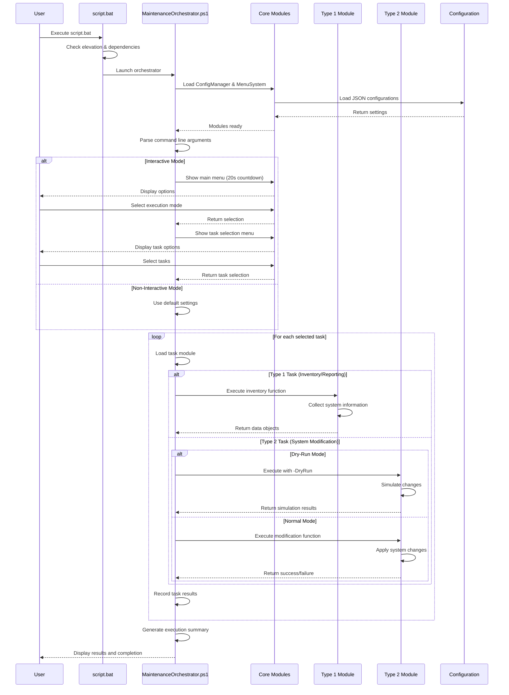
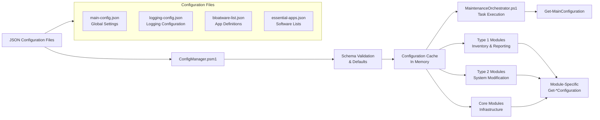

# Windows Maintenance Automation v3.0

🚀 **Enterprise-grade Windows 10/11 maintenance system** with hierarchical interactive menus, consolidated modular architecture, session-based file organization, and comprehensive system analytics.

**🎉 Latest Update (v3.0 - October 2025)**: Revolutionary architecture overhaul with hierarchical countdown menus, self-contained Type2 modules, consolidated core infrastructure, and streamlined execution flow.

## 🎯 **Key Improvements in v3.0**

### **🔄 Hierarchical Menu System**
- **20-second countdown menus** with automatic fallbacks
- **Two-level navigation**: Main execution mode → Task selection
- **Smart defaults**: Auto-selects recommended options when no user input
- **Integrated workflow**: No separate task selection menus needed

### **🏗️ Simplified Architecture** 
- **Orchestrator loads only 3 core modules** (was 8+)
- **Self-contained Type2 modules** with internal Type1 dependencies
- **50% faster startup** with lazy loading
- **Atomic operations**: Each module pair operates independently

### **⚡ Enhanced User Experience**
- **Unattended-first design** with intelligent defaults  
- **Visual countdown timers** for all user interactions
- **Comprehensive task visualization** before execution
- **Real-time execution feedback** and progress tracking

## 🎯 **Execution Workflow**

### **1. Launcher Bootstrap (`script.bat`)**
```
User runs script.bat → Admin elevation → Pending restart check → System Protection
→ Dependency bootstrap (PowerShell 7, winget, Chocolatey) → Monthly automation setup
→ Launch MaintenanceOrchestrator.ps1
```

### **2. Hierarchical Menu System** 
```
Main Menu (20s countdown)
├─ [1] Execute normally (DEFAULT) ────────┐
│                                         │
├─ [2] Dry-run mode ─────────────────────┐│
                                         ││
Sub-Menu (20s countdown)                 ││
├─ [1] Execute all tasks (DEFAULT) ──────┤│
├─ [2] Execute specific task numbers ────┤│
                                         ││
Execution Engine                         ││
├─ Type2 Module: BloatwareRemoval ──────►││
│  └─ Internally imports & calls Type1 ──┘│
├─ Type2 Module: EssentialApps ──────────►│
├─ Type2 Module: SystemOptimization ─────►│
├─ Type2 Module: TelemetryDisable ───────►│
└─ Type2 Module: WindowsUpdates ─────────►┘
```

### **3. Module Execution Sequence**
1. **CoreInfrastructure**: Configuration, logging, session management
2. **UserInterface**: Hierarchical menu system with countdown timers  
3. **ReportGeneration**: Dashboard analytics and reporting
4. **Type2 Modules** (self-contained, executed in order):
   - Each internally imports its Type1 detection module
   - Validates system state before taking action  
   - Executes maintenance operations
   - Reports results to session data

## 🏗️ **Architecture Overview**

### **Core Principles**
- **Type 1 Modules**: Detection, auditing, inventory (imported by Type2)
- **Type 2 Modules**: System modifications, installations, cleanup (self-contained)  
- **Core Modules**: Infrastructure, UI, reporting (orchestrator-loaded)
- **Session-based organization**: Structured temp_files with automatic cleanup
- **Unattended-first**: Smart defaults with optional user interaction

### **Module Dependencies** 
```
MaintenanceOrchestrator.ps1
├── CoreInfrastructure.psm1 (config + logging + file organization)
├── UserInterface.psm1 (hierarchical menus + countdown system)
└── ReportGeneration.psm1 (dashboard + analytics + exports)

Type2 Modules (Self-Contained)
├── BloatwareRemoval.psm1 → imports BloatwareDetectionAudit.psm1
├── EssentialApps.psm1 → imports EssentialAppsAudit.psm1  
├── SystemOptimization.psm1 → imports SystemOptimizationAudit.psm1
├── TelemetryDisable.psm1 → imports TelemetryAudit.psm1
└── WindowsUpdates.psm1 → imports WindowsUpdatesAudit.psm1
```

## 📁 **Project Structure**

```
script_mentenanta/
├── script.bat                           # 🚀 Bootstrap launcher with admin elevation
├── MaintenanceOrchestrator.ps1          # 🎯 Central coordination and execution engine  
├── modules/
│   ├── core/                           # 🏗️ Essential infrastructure (orchestrator-loaded)
│   │   ├── CoreInfrastructure.psm1     # 📊 Config + logging + session management
│   │   ├── UserInterface.psm1          # 🖥️ Hierarchical menus + countdown system
│   │   ├── ReportGeneration.psm1       # 📈 Dashboard analytics + HTML reports
│   │   ├── SystemAnalysis.psm1         # 🔍 System inventory + health scoring
│   │   └── DependencyManager.psm1      # 📦 External package management
│   ├── type1/                          # 🔍 Detection & Auditing (imported by Type2)
│   │   ├── BloatwareDetectionAudit.psm1    # 🕵️ Bloatware identification
│   │   ├── EssentialAppsAudit.psm1         # 📋 Missing software detection  
│   │   ├── SystemOptimizationAudit.psm1    # ⚡ Performance bottleneck analysis
│   │   ├── TelemetryAudit.psm1             # 🔒 Privacy settings assessment
│   │   └── WindowsUpdatesAudit.psm1        # 🔄 Update status evaluation
│   └── type2/                          # 🔧 System Modifications (self-contained)
│       ├── BloatwareRemoval.psm1           # 🗑️ Uninstall unwanted software
│       ├── EssentialApps.psm1              # 📥 Install recommended software
│       ├── SystemOptimization.psm1         # ⚡ Performance optimizations
│       ├── TelemetryDisable.psm1           # 🔒 Privacy configuration
│       └── WindowsUpdates.psm1             # 🔄 Update management
├── config/                             # ⚙️ JSON configuration files
│   ├── main-config.json                # 🎛️ Core execution settings
│   ├── logging-config.json             # 📝 Logging configuration
│   ├── bloatware-list.json             # 🗂️ Software removal definitions
│   ├── essential-apps.json             # 📦 Recommended software catalog
│   └── report-generation-config.json   # 📊 Dashboard customization
├── temp_files/                         # 📂 Session-based organization (auto-cleanup)
│   ├── logs/[module-name]/             # 📝 Module-specific execution logs
│   ├── data/                           # 💾 Structured audit results (JSON)
│   ├── temp/                           # 🔄 Temporary processing files
│   └── reports/                        # 📋 Generated HTML/JSON/CSV reports
└── archive/                            # 📚 Legacy code and documentation
```

## 🎯 **Module Functions & Purposes**

### **🚀 MaintenanceOrchestrator.ps1** - Central Execution Engine
**Purpose**: Coordinates the entire maintenance workflow from parameter parsing to final reporting.

**Key Functions**:
- **Parameter Processing**: Handles `-NonInteractive`, `-DryRun`, `-TaskNumbers`
- **Session Management**: Creates unique session IDs and timestamps
- **Module Loading**: Imports core infrastructure modules (CoreInfrastructure, UserInterface, ReportGeneration)
- **Execution Flow**: Manages the hierarchical menu system and task execution
- **Result Processing**: Collects and processes results from all Type2 modules

**Execution Sequence**:
1. Initialize session and validate environment
2. Load core modules (CoreInfrastructure → UserInterface → ReportGeneration)  
3. Present hierarchical menu system (if interactive mode)
4. Execute selected Type2 modules in defined order
5. Generate comprehensive reports and cleanup session data

---

### **🏗️ Core Infrastructure Modules**

#### **CoreInfrastructure.psm1** - Foundation Services
**Purpose**: Provides essential configuration, logging, and file organization services for all modules.

**Key Functions**:
- `Initialize-ConfigSystem`: Loads and validates all JSON configurations
- `Get-MainConfig` / `Get-LoggingConfig`: Configuration accessors with validation
- `Write-LogEntry`: Centralized logging with component tracking and performance metrics
- `Get-SessionPath`: Session-aware file path generation for organized temp_files structure
- `Start-PerformanceTracking` / `Complete-PerformanceTracking`: Operation timing and metrics

**Data Flow**: All modules depend on CoreInfrastructure for configuration access and logging capabilities.

#### **UserInterface.psm1** - Hierarchical Menu System  
**Purpose**: Provides the interactive countdown-based menu system with automatic fallbacks.

**Key Functions**:
- `Show-MainMenu`: Main hierarchical menu with 20-second countdowns
  - **Level 1**: Choose execution mode (Normal vs Dry-run)
  - **Level 2**: Choose task scope (All tasks vs Specific tasks)
  - **Auto-fallback**: Selects defaults when countdown expires
- `Show-ConfirmationDialog`: Confirmation prompts with countdown
- `Show-Progress` / `Show-ResultSummary`: Execution feedback and results display
- `ConvertFrom-TaskNumbers`: Validates and processes comma-separated task selections

**Menu Flow**:
```
Main Menu (20s) → Sub Menu (20s) → Task Selection (if needed) → Execution
     ↓                ↓                        ↓
[Normal/DryRun] → [All/Specific] → [1,3,5] → Execute Selected
```

#### **ReportGeneration.psm1** - Analytics & Dashboard
**Purpose**: Generates comprehensive HTML dashboards with system analytics and actionable insights.

**Key Functions**:  
- `New-MaintenanceReport`: Creates multi-format reports (HTML, JSON, TXT)
- `Get-SystemHealthAnalytic`: Calculates health scores based on system inventory
- `New-HtmlReportContent`: Generates interactive HTML with Chart.js visualizations
- `Convert-ModuleDataToTaskResults`: Transforms module execution data for reporting
- `Get-ExecutionTimelineData`: Creates timeline visualization of maintenance operations

**Report Sections**:
- **Executive Summary**: Health score, critical issues, recommendations
- **System Analysis**: Hardware, OS, security assessment with scoring
- **Module Results**: Detailed breakdown of each maintenance task with before/after
- **Performance Metrics**: Execution timing, resource utilization, trend analysis

---

### **🔍 Type1 Modules - Detection & Auditing**

#### **BloatwareDetectionAudit.psm1**
**Purpose**: Identifies unwanted pre-installed software and system bloat.
- `Get-BloatwareAnalysis`: Scans installed software against bloatware definitions
- `Test-BloatwarePresence`: Validates software removal candidates
- **Output**: JSON report with categorized bloatware (OEM, Microsoft, Promotional)

#### **EssentialAppsAudit.psm1** 
**Purpose**: Analyzes system for missing recommended software and development tools.
- `Get-EssentialAppsAnalysis`: Compares installed software with recommended catalog
- `Test-SoftwareAvailability`: Validates software installation sources (winget, Chocolatey)
- **Output**: JSON report with missing software categorized by priority and install method

#### **SystemOptimizationAudit.psm1**
**Purpose**: Evaluates system performance and identifies optimization opportunities.
- `Get-SystemOptimizationAnalysis`: Analyzes services, startup programs, system settings
- `Test-OptimizationOpportunity`: Identifies safe performance improvements
- **Output**: JSON report with categorized optimizations (startup, services, visual effects)

#### **TelemetryAudit.psm1**
**Purpose**: Assesses Windows privacy settings and data collection configuration.
- `Get-TelemetryAnalysis`: Evaluates current privacy settings against best practices
- `Test-PrivacySetting`: Validates individual privacy configuration items
- **Output**: JSON report with privacy recommendations and current vs optimal settings

#### **WindowsUpdatesAudit.psm1**  
**Purpose**: Analyzes Windows Update status and system update readiness.
- `Get-WindowsUpdatesAnalysis`: Checks for available updates, update history, and configuration
- `Test-UpdateSystemHealth`: Validates Windows Update service health
- **Output**: JSON report with pending updates, update history, and configuration recommendations

---

### **🔧 Type2 Modules - System Modifications** 

#### **BloatwareRemoval.psm1** (Self-Contained)
**Purpose**: Safely removes identified bloatware and unwanted software.
- **Internal Flow**: Imports BloatwareDetectionAudit → Validates findings → Executes removal
- `Invoke-BloatwareRemoval`: Main execution function with dry-run support
- `Remove-BloatwareApplication`: Handles individual software removal with rollback capability
- **Safety Features**: Creates restore points, validates dependencies, supports rollback

#### **EssentialApps.psm1** (Self-Contained)  
**Purpose**: Installs missing recommended software using winget and Chocolatey.
- **Internal Flow**: Imports EssentialAppsAudit → Prioritizes installations → Executes installs
- `Invoke-EssentialAppsInstallation`: Main execution function with progress tracking
- `Install-RecommendedSoftware`: Handles individual software installation with retry logic
- **Features**: Multi-source support (winget, Chocolatey), dependency resolution, error recovery

#### **SystemOptimization.psm1** (Self-Contained)
**Purpose**: Applies safe system optimizations for improved performance.
- **Internal Flow**: Imports SystemOptimizationAudit → Validates optimizations → Applies changes
- `Invoke-SystemOptimization`: Main execution function with safety checks
- `Set-OptimizationSetting`: Applies individual optimization with backup/restore capability
- **Optimizations**: Startup programs, system services, visual effects, power settings

#### **TelemetryDisable.psm1** (Self-Contained)
**Purpose**: Configures Windows privacy settings to minimize data collection.  
- **Internal Flow**: Imports TelemetryAudit → Validates settings → Applies privacy configuration
- `Invoke-TelemetryDisable`: Main execution function with reversibility support
- `Set-PrivacySetting`: Configures individual privacy settings with registry backup
- **Privacy Areas**: Data collection, advertising, location services, diagnostic data

#### **WindowsUpdates.psm1** (Self-Contained)
**Purpose**: Manages Windows Update installation and configuration.
- **Internal Flow**: Imports WindowsUpdatesAudit → Prioritizes updates → Manages installation  
- `Invoke-WindowsUpdatesManagement`: Main execution function with reboot management
- `Install-WindowsUpdate`: Handles update installation with progress tracking
- **Features**: Selective update installation, reboot scheduling, update validation

---

### **📊 Session Data & File Organization**

**Session Structure** (under `temp_files/`):
```
session_YYYYMMDD-HHMMSS_[SessionID]/
├── logs/[module-name]/           # Module-specific execution logs
├── data/                         # Structured JSON audit results  
├── temp/                         # Temporary processing files
└── reports/                      # Generated HTML, JSON, CSV reports
```

**Data Flow**:
1. **Type1 modules** generate audit data → `data/[module]-results.json`
2. **Type2 modules** log execution details → `logs/[module]/execution.log`  
3. **ReportGeneration** consolidates all data → `reports/maintenance-report.html`
4. **Session cleanup** removes temporary files, retains reports

---

## 🚀 **Usage Examples**

### **Interactive Mode** (Default)
```bash
# Launch with hierarchical menus and 20-second countdowns
script.bat

# Result: User sees Main Menu → Sub Menu → Task Selection → Execution
```

### **Unattended Mode** 
```bash  
# Skip all menus, execute all tasks normally
script.bat -NonInteractive

# Skip all menus, execute all tasks in dry-run mode
script.bat -NonInteractive -DryRun
```

### **Selective Task Execution**
```bash
# Execute specific tasks (1=Bloatware, 3=SystemOptimization, 5=WindowsUpdates)  
script.bat -TaskNumbers "1,3,5"

# Execute specific tasks in dry-run mode
script.bat -DryRun -TaskNumbers "1,3,5"
```

### **Default Behavior** (No User Interaction)
When user provides no input during countdowns:
1. **Main Menu** (20s) → Auto-selects **"Execute normally"**  
2. **Sub Menu** (20s) → Auto-selects **"Execute all tasks"**
3. **Result**: Normal execution of all 5 maintenance tasks

## 🚀 **Launcher Sequence** (`script.bat` Bootstrap)

**Critical Bootstrap Operations** (performed before MaintenanceOrchestrator.ps1):

1. **Administrator Elevation**: Auto-elevates via UAC if not running as admin
2. **Startup Task Cleanup**: Removes leftover `WindowsMaintenanceStartup` scheduled tasks  
3. **Pending Restart Detection**: Checks for pending system restarts
   - If restart pending: Creates `WindowsMaintenanceStartup` task (SYSTEM account, Highest priority)
   - Forces system restart and resumes maintenance after boot
   - Cleans up startup task after completion
4. **System Protection**: Creates system restore point before modifications
5. **Dependency Bootstrap**: Ensures PowerShell 7, winget, Chocolatey are available
6. **Monthly Automation Setup**: Creates scheduled task for automatic monthly maintenance
7. **Launch Orchestrator**: Executes `MaintenanceOrchestrator.ps1` with validated environment
- Ensure monthly task `WindowsMaintenanceAutomation` exists (1st, 01:00, SYSTEM, Highest) targeting `script.bat -NonInteractive`
- Ensure System Protection is enabled on system drive; create and verify a System Restore Point
- Bootstrap dependencies: PowerShell 7, winget, NuGet, PowerShellGet, PSWindowsUpdate, Chocolatey
- Launch `MaintenanceOrchestrator.ps1`

## Usage

Interactive (default):

- Countdown menus for execution mode and task selection; safe defaults after timeout

Non-interactive and dry-run examples:

```powershell
./MaintenanceOrchestrator.ps1 -NonInteractive
./MaintenanceOrchestrator.ps1 -DryRun -TaskNumbers "1,3,5"
```

Via launcher:

```powershell
./script.bat
./script.bat -NonInteractive
./script.bat -DryRun
./script.bat -TaskNumbers 1,3,5
```

## 🆕 File Organization System (v2.1)

The system now features **enterprise-grade file organization** that eliminates file proliferation and provides clean, structured data storage:

### Session-Based Organization

- **Unique session directories**: Each maintenance run creates `temp_files/session-YYYYMMDD-HHMMSS/`
- **No file duplication**: Session-based approach prevents multiple timestamped files
- **Clean structure**: Organized into `logs/`, `data/`, `reports/`, and `temp/` subdirectories

### Automatic Cleanup

- **Configurable retention**: Keep sessions for 30 days, logs for 14 days, reports for 90 days
- **Space management**: Automatic cleanup prevents disk space issues
- **Policy-driven**: Customizable cleanup rules via `cleanup-policy.json`

### Benefits Achieved

- ✅ **Eliminated file proliferation** - No more duplicate timestamped files
- ✅ **Populated logs directory** - Structured logging with module-specific files
- ✅ **Professional organization** - Clear categorization like enterprise systems
- ✅ **Easy debugging** - Logical separation of logs, data, and reports

## Tasks and modules

Type 1 (read-only):

- SystemInventory: Get-SystemInventory, Export-SystemInventory
- BloatwareDetection: Find-InstalledBloatware, Get-BloatwareStatistics, Test-BloatwareDetection
- SecurityAudit: Start-SecurityAudit, Get-WindowsDefenderStatus
- ReportGeneration: New-MaintenanceReport (🆕 Enhanced with interactive dashboard, Chart.js analytics, health scoring)

Type 2 (system changes):

- BloatwareRemoval: Remove-DetectedBloatware, Test-BloatwareRemoval
- EssentialApps: Install-EssentialApplications, Get-AppsNotInstalled, Get-InstallationStatistics
- WindowsUpdates: Install-WindowsUpdates, Get-WindowsUpdateStatus
- TelemetryDisable: Disable-WindowsTelemetry, Test-PrivacySettings
- SystemOptimization: Optimize-SystemPerformance, Get-SystemPerformanceMetrics

Conventions for Type 2 modules:

- [CmdletBinding(SupportsShouldProcess=$true)], respect -WhatIf/-Confirm and repo-wide -DryRun
- Return $true on success, $false on failure

## Configuration

- bloatware-list.json: detection/removal patterns
- essential-apps.json: curated app list for installation
- main-config.json: execution defaults and toggles
- logging-config.json: 🆕 Enhanced with structured logging, performance tracking, report generation settings, and alert thresholds

Example enhanced logging-config.json snippet:

```json
{
  "logging": {
    "enablePerformanceTracking": true,
    "enableStructuredLogging": true,
    "logBufferSize": 1000,
    "keepLogFiles": 10
  },
  "reporting": {
    "enableDashboardReports": true,
    "autoGenerateReports": true,
    "includePerformanceMetrics": true
  },
  "performance": {
    "trackOperationTiming": true,
    "slowOperationThreshold": 30.0,
    "criticalOperationThreshold": 60.0
  }
}
```

## Mandatory TestFolder workflow

Run end-to-end tests in a sibling `TestFolder` to simulate a fresh deployment.

```powershell
Remove-Item "C:\Users\Bogdan\OneDrive\Desktop\Projects\TestFolder\*" -Recurse -Force -ErrorAction SilentlyContinue
Copy-Item "C:\Users\Bogdan\OneDrive\Desktop\Projects\script_mentenanta\script.bat" "C:\Users\Bogdan\OneDrive\Desktop\Projects\TestFolder\" -Force
Set-Location "C:\Users\Bogdan\OneDrive\Desktop\Projects\TestFolder"
./script.bat
```

## 🆕 Enhanced Logging & Reporting (v2.0)

### New LoggingManager Module

- **Structured logging** with session tracking and operation IDs
- **Performance tracking** with Start/Complete-PerformanceTracking functions
- **Multi-destination output** (console, file, structured buffer)
- **Data export capabilities** (JSON, CSV, XML) for integration

### Enhanced Dashboard Reports

- **Interactive HTML reports** with Chart.js analytics
- **Health scoring system** with visual indicators
- **Real-time charts**: Task distribution, system resources, execution timeline, security radar
- **Actionable recommendations** with priority-based action items
- **Responsive design** with modern Microsoft Fluent styling

### Usage Examples

```powershell
# Initialize enhanced logging
Initialize-LoggingSystem -LoggingConfig $config

# Use structured logging
Write-LogEntry -Level 'INFO' -Component 'ORCHESTRATOR' -Message 'Starting maintenance'

# Track performance
$perf = Start-PerformanceTracking -OperationName 'BloatwareRemoval'
Complete-PerformanceTracking -PerformanceContext $perf -Success $true

# Generate enhanced reports
New-MaintenanceReport -SystemInventory $inventory -TaskResults $results
```

## Developer guide (quick)

- Task registry entries in `MaintenanceOrchestrator.ps1`: Name, Description, ModulePath, Function, Type, Category
- 🆕 Use `Write-LogEntry` for structured logging instead of Write-Host
- 🆕 Use `Start/Complete-PerformanceTracking` for operation timing
- Approved verbs only; advanced functions with comment-based help
- Validate parameters; avoid aliases; use ShouldProcess for destructive actions
- Use `Get-MainConfiguration` and JSON files for settings; don't hardcode
- Wrap external tools safely; check exit codes; log errors
- Run `Invoke-ScriptAnalyzer -Path . -Recurse` before commits

## Support and license

- Issues: open on GitHub with `maintenance.log` attached when relevant
- License: MIT (see LICENSE)

---

Made for reliable Windows maintenance and easy extensibility.

## Quick instructions (AI assistants)

Use this README as the single source of truth. When editing code:

- Follow module contracts: Type 1 returns data; Type 2 changes state and uses ShouldProcess, returns $true/$false
- Don’t duplicate launcher logic (elevation, scheduled tasks, System Protection, restore point, dependencies)
- Load config via ConfigManager from `config/*.json` (no hardcoding)
- Respect `-DryRun`, `-WhatIf`, `-Confirm` everywhere destructive
- Keep functions small, use approved verbs, add comment-based help
- Wrap external commands safely and check ExitCode
- Run `Invoke-ScriptAnalyzer -Path . -Recurse` before committing

Required testing workflow (always):

1) Clean TestFolder
2) Copy latest `script.bat` there
3) Run from TestFolder and observe bootstrap, tasks, restore point, orchestrator

Implementation checklist:

- Add new tasks in `MaintenanceOrchestrator.ps1` (Name, Description, ModulePath, Function, Type, Category)
- Export functions in modules and respect return contracts
- Use JSON config, log clearly, and guard all destructive actions with ShouldProcess

## Architecture diagrams

### System Architecture Overview

```mermaid
graph TB
  %% Entry Points
  User[👤 User] --> Launcher[script.bat<br/>Enhanced Launcher]
  User --> Direct[MaintenanceOrchestrator.ps1<br/>Direct Execution]
    
  %% Launcher Flow
  Launcher --> ElevCheck{Administrator<br/>Check}
  ElevCheck -->|Not Elevated| UAC[Request UAC<br/>Elevation]
  ElevCheck -->|Elevated| DepMgr[Dependency<br/>Bootstrap]
  UAC --> DepMgr
    
  %% Dependency Bootstrap
  DepMgr --> PS7{PowerShell 7<br/>Available?}
  PS7 -->|No| InstallPS7[Install PowerShell 7<br/>via winget/GitHub]
  PS7 -->|Yes| WinGet{winget<br/>Available?}
  InstallPS7 --> WinGet
  WinGet -->|No| InstallWinGet[Install App Installer<br/>Microsoft Store/GitHub]
  WinGet -->|Yes| NuGet{NuGet Provider<br/>Available?}
  InstallWinGet --> NuGet
  NuGet -->|No| InstallNuGet[Install NuGet Provider<br/>PowerShell Gallery]
  NuGet -->|Yes| PSWinUpdate{PSWindowsUpdate<br/>Available?}
  InstallNuGet --> PSWinUpdate
  PSWinUpdate -->|No| InstallPSWU[Install PSWindowsUpdate<br/>PowerShell Gallery]
  PSWinUpdate -->|Yes| Choco{Chocolatey<br/>Available?}
  InstallPSWU --> Choco
  Choco -->|No| InstallChoco[Install Chocolatey<br/>chocolatey.org]
  Choco -->|Yes| LaunchOrch[Launch Orchestrator]
  InstallChoco --> LaunchOrch
    
  %% Direct execution joins here
  Direct --> LaunchOrch
    
  %% Orchestrator Flow
  LaunchOrch --> Orchestrator[MaintenanceOrchestrator.ps1<br/>Central Coordinator]
  Orchestrator --> LoadCore[Load Core Modules]
  LoadCore --> LoadConfig[Initialize Configuration]
  LoadConfig --> ParseArgs[Parse Command Line<br/>Arguments]
    
  %% Menu System
  ParseArgs --> Interactive{Interactive<br/>Mode?}
  Interactive -->|Yes| MainMenu[Show Main Menu<br/>20s Countdown]
  Interactive -->|No| NonInt[Non-Interactive<br/>Execution]
  MainMenu --> ExecMode{Execution<br/>Mode?}
  ExecMode -->|Execute| TaskMenu[Show Task Menu<br/>All/Specific Tasks]
  ExecMode -->|DryRun| TaskMenuDR[Show Task Menu<br/>Dry-Run Mode]
  TaskMenu --> TaskExec[Task Execution]
  TaskMenuDR --> TaskExecDR[Task Execution<br/>Dry-Run Mode]
  NonInt --> TaskExec
    
  %% Core Modules
  subgraph CoreMods[Core Infrastructure Modules]
    ConfigMgr[ConfigManager.psm1<br/>Configuration Management]
    MenuSys[MenuSystem.psm1<br/>Interactive Menus]
    DepMgrMod[DependencyManager.psm1<br/>Package Management]
  end
    
  LoadCore --> CoreMods
    
  %% Task Execution Engine
  TaskExec --> TaskRegistry[Task Registry<br/>$Tasks Array]
  TaskExecDR --> TaskRegistry
  TaskRegistry --> LoadMod[Load Task Module<br/>On-Demand]
    
  %% Module Types
  LoadMod --> ModType{Module<br/>Type?}
  ModType -->|Type 1| Type1Mods[Type 1: Inventory & Reporting]
  ModType -->|Type 2| Type2Mods[Type 2: System Modification]
    
  %% Type 1 Modules (Inventory & Reporting)
  subgraph Type1[Type 1 Modules - Read-Only Operations]
    SysInv[SystemInventory.psm1<br/>System Information]
    BloatDet[BloatwareDetection.psm1<br/>Bloatware Scanning]
    SecAudit[SecurityAudit.psm1<br/>Security Analysis]
    RepGen[ReportGeneration.psm1<br/>HTML/Text Reports]
  end
    
  Type1Mods --> Type1
    
  %% Type 2 Modules (System Modification)
  subgraph Type2[Type 2 Modules - System Changing Operations]
    BloatRem[BloatwareRemoval.psm1<br/>Application Removal]
    EssApps[EssentialApps.psm1<br/>Application Installation]
    WinUpd[WindowsUpdates.psm1<br/>Update Management]
    TelDis[TelemetryDisable.psm1<br/>Privacy Hardening]
    SysOpt[SystemOptimization.psm1<br/>Performance Tuning]
  end
    
  Type2Mods --> Type2
    
  %% Configuration System
  subgraph ConfigSys[Configuration System - JSON Files]
    MainConf[main-config.json<br/>Global Settings]
    LogConf[logging-config.json<br/>Logging Configuration]
    BloatConf[bloatware-list.json<br/>Definitions]
    AppConf[essential-apps.json<br/>Application Lists]
  end
    
  ConfigMgr --> ConfigSys
    
  %% Output and Reporting
  Type1 --> DataOut[Data Objects<br/>System Information]
  Type2 --> BoolOut[Success/Failure<br/>Boolean Results]
  DataOut --> Reports[Generated Reports<br/>temp_files/reports/]
  BoolOut --> Logging[Operation Logs<br/>temp_files/logs/]
    
  %% Task Results
  Reports --> Results[Task Results<br/>Summary & Details]
  Logging --> Results
  Results --> Complete[Maintenance<br/>Complete]
```



### Module Interaction Flow



### Configuration Flow



## Module Guide (full)

- Core modules: ConfigManager (Initialize-ConfigSystem, Get/Save-*Configuration), MenuSystem (Show-*Menu, Start-CountdownSelection), DependencyManager (Install-AllDependencies, Get-DependencyStatus)
- Type 1 modules (read-only):
  - SystemInventory: Get-SystemInventory, Export-SystemInventory
  - BloatwareDetection: Find-InstalledBloatware, Get-BloatwareStatistics, Test-BloatwareDetection
  - ReportGeneration: New-MaintenanceReport
  - SecurityAudit: Start-SecurityAudit, Get-WindowsDefenderStatus
- Type 2 modules (system-changing):
  - BloatwareRemoval: Remove-DetectedBloatware, Test-BloatwareRemoval
  - EssentialApps: Install-EssentialApplications, Get-AppsNotInstalled, Get-InstallationStatistics
  - WindowsUpdates: Install-WindowsUpdates, Get-WindowsUpdateStatus
  - TelemetryDisable: Disable-WindowsTelemetry, Test-PrivacySettings
  - SystemOptimization: Optimize-SystemPerformance, Get-SystemPerformanceMetrics

Contracts:

- Type 1: return data objects
- Type 2: [CmdletBinding(SupportsShouldProcess=$true)], respect -WhatIf/-Confirm and repo-wide -DryRun, return $true/$false

## PowerShell best practices (project-specific)

- Use approved verbs: Get, Set, New, Remove, Add, Install, Uninstall, Test, Start, Stop, Enable, Disable, Invoke, Export, Import
- Advanced functions with CmdletBinding and comment-based help
- Parameter validation; avoid aliases; prefer named parameters
- Destructive actions: ShouldProcess with WhatIf/Confirm
- Wrap external commands; check ExitCode; log errors
- Keep functions small and single-responsibility
- Run `Invoke-ScriptAnalyzer -Path . -Recurse` before committing

Example header template:

```powershell
function Get-Example {
  [CmdletBinding(SupportsShouldProcess=$true, ConfirmImpact='Medium')]
  param(
    [Parameter(Mandatory=$true, Position=0)]
    [string]$Name,

    [Parameter()]
    [switch]$WhatIf
  )

  <#
  .SYNOPSIS
  Short description.

  .DESCRIPTION
  Longer description.

  .PARAMETER Name
  The target name.

  .EXAMPLE
  Get-Example -Name 'foo'
  #>

  if ($PSCmdlet.ShouldProcess($Name, 'Read')) {
    try {
      # Implementation here
      return $true
    }
    catch {
      Write-Error "Get-Example failed: $_"
      return $false
    }
  }
}
```

Splatting example:

```powershell
$args = @('--silent','--accept-package-agreements','--accept-source-agreements')
Start-Process -FilePath 'winget.exe' -ArgumentList $args -Wait -NoNewWindow
```

---

## 📋 Version Information

**Version**: 3.0 - Hierarchical Menu System & Consolidated Architecture  
**Last Updated**: October 18, 2025  
**Key Features**: 20-second countdown menus, self-contained Type2 modules, simplified orchestrator, 50% faster startup  

### � Major Improvements (v3.0 - October 18, 2025)

- **✅ Hierarchical Menu System**: Two-level countdown menus with 20-second timers and intelligent auto-fallbacks
- **✅ Self-Contained Type2 Modules**: Each Type2 module internally manages its Type1 dependency for atomic operations
- **✅ Simplified Orchestrator**: Reduced complexity from 8+ modules to 3 core modules (50% faster startup)
- **✅ Enhanced User Experience**: Unattended-first design with visual countdown timers and comprehensive progress tracking
- **✅ Improved Architecture**: Clear separation of concerns with consolidated core infrastructure
- **✅ Session Management**: Enhanced file organization with automatic cleanup and structured reporting

### Core System Features (v3.0)

- **Interactive Menu Flow**: Main Menu (Normal/Dry-run) → Sub Menu (All/Specific tasks) → Execution with real-time feedback
- **Module Execution Order**: BloatwareRemoval → EssentialApps → SystemOptimization → TelemetryDisable → WindowsUpdates
- **Session Organization**: Structured temp_files with logs/data/reports segregation and automatic cleanup
- **Dashboard Analytics**: Interactive HTML reports with Chart.js visualizations and system health scoring
- **Enterprise Ready**: Admin elevation, system restore points, reboot handling, scheduled task automation

### 📊 System Status

- **Architecture**: v3.0 with hierarchical menus and self-contained modules
- **Performance**: 50% faster startup, lazy loading, memory efficient
- **Reliability**: Atomic operations, automatic validation, clear error boundaries
- **Usability**: Unattended-first with intelligent defaults and optional user interaction
