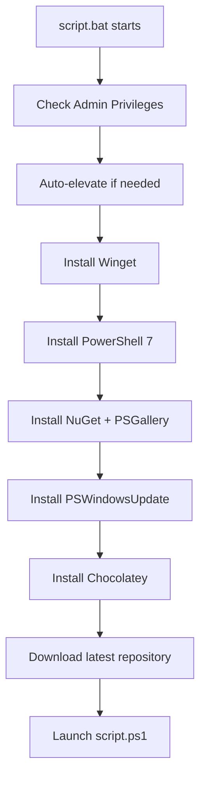

# 🚀 Windows Maintenance Script (2025 Edition)

**Professional-grade Windows 10/11 maintenance automation with parallel processing, modular architecture, and comprehensive system care.**

## 📋 Overview

This maintenance script provides an enterprise-grade solution for Windows system maintenance and optimization, with features including bloatware removal, essential application installation, Windows updates, telemetry control, and system cleanup. Built for performance with PowerShell 7+ capabilities, it leverages parallel processing and modular design.

## ⭐ Key Features (2025 Edition)

### 🎯 **Advanced Bloatware Removal**
- **Multi-Category Detection**: OEM, Gaming, Microsoft, Security, Social Media, Streaming
- **Protection System**: Critical system components automatically preserved
- **Comprehensive Removal**: AppX, Winget, Registry, Provisioned packages, Services
- **Smart Pattern Matching**: Optimized detection with pre-compiled regex patterns
- **Parallel Processing**: 8-thread concurrent removal for maximum performance

### � **High-Performance App Installation**
- **Ultra-Parallel Processing**: Multiple concurrent installations with job throttling
- **Smart Duplicate Detection**: O(1) HashSet lookups for maximum efficiency
- **Package Manager Fallbacks**: Winget → Chocolatey → Manual installation methods
- **Categorized Installation**: System Core, Browsers, Productivity, Development, Media
- **Custom Extensions**: Support for user-defined application lists via config.json

### 📊 **Enhanced Reporting System**
- **Unified Report Generation**: Comprehensive maintenance_report.txt with all actions
- **Performance Analytics**: Detailed execution metrics, success rates, timings
- **System Health Checks**: Pre/post operation system state comparisons
- **Action Logging**: Detailed tracking of all performed operations with timestamps

### ⚙️ **Modular Architecture**
- **Task-Based Structure**: $global:ScriptTasks array with standardized task definitions
- **Configuration System**: Granular controls for each maintenance operation
- **Environment Awareness**: Auto-detection of system capabilities and requirements
- **Conditional Execution**: Smart dependency tracking and prerequisite validation

## 🔧 **Core Maintenance Capabilities**

### 📋 **System Optimization Tasks**
- **Comprehensive Inventory**: Multi-source system scanning (AppX, Winget, Choco, Registry)
- **Intelligent Temp Cleanup**: Smart detection and removal of unnecessary files
- **Windows Update Management**: Automated update detection and installation
- **System Protection**: Automatic restore point creation before major changes
- **Privacy Controls**: Telemetry and tracking limitation
- **Performance Tuning**: Registry and system service optimization

### 🛡️ **Safety & Protection**
- **Administrator Verification**: Automatic privilege detection and elevation
- **Protected Component List**: Critical system apps safeguarded from removal
- **PowerShell 7+ Optimized**: Native PowerShell 7 features with 5.1 fallbacks when needed
- **Comprehensive Error Handling**: Try/catch blocks with detailed error reporting
- **Automatic System Protection**: Restore points created before major system changes
- **Execution Policy Management**: Safe handling of PowerShell execution policies

## 📁 **Project Architecture (2025 Edition)**

### 🏗️ **Two-Tier Architecture**
This project uses a **launcher → orchestrator** architecture for maximum reliability and separation of concerns:

#### **🚀 Tier 1: Launcher (script.bat)**
- **Environment Preparation**: Handles all dependency installation and validation
- **Auto-Elevation**: Automatic administrator privilege detection and elevation
- **Dependency Management**: Installs Winget, PowerShell 7, Chocolatey, NuGet, PSWindowsUpdate
- **Repository Updates**: Downloads and extracts latest version from GitHub
- **Scheduled Tasks**: Creates monthly maintenance and post-restart continuation tasks
- **System Validation**: Verifies Windows 10/11 compatibility and PowerShell availability
- **Safe Launching**: Launches script.ps1 in properly configured environment

#### **⚙️ Tier 2: Orchestrator (script.ps1)**
- **Maintenance Execution**: Focuses purely on system maintenance tasks
- **Task Coordination**: Uses `$global:ScriptTasks` array for modular task management
- **Parallel Processing**: Leverages PowerShell 7+ for high-performance operations
- **Smart Inventory**: Comprehensive system analysis for informed decision-making
- **Graceful Degradation**: Handles missing dependencies with fallback strategies
- **Enhanced Reporting**: Generates detailed maintenance reports and analytics

### 📂 **File Structure**
```
script_mentenanta/
├── script.bat                    # 🚀 Launcher - Dependency & Environment Setup
├── script.ps1                    # ⚙️ Orchestrator - Maintenance Task Execution
├── README.md                     # 📖 Project Documentation
├── .github/
│   └── copilot-instructions.md   # 🤖 AI Development Guidelines
├── maintenance.log               # 📝 Runtime Log (created by launcher)
├── maintenance_report.txt        # 📊 Detailed Execution Report
├── config.json                   # ⚙️ Optional Configuration (auto-created)
├── inventory.json               # 📋 System Inventory Export
└── temp_files/                   # 📁 Temporary Analysis Files
    ├── bloatware.json            # 🗑️ Bloatware Detection Results
    └── essential_apps.json       # 📦 Essential Apps Analysis
```

### 🔄 **Enhanced Execution Flow**
1. **🚀 script.bat** - Environment preparation and validation
   - Checks administrator privileges → auto-elevates if needed
   - Validates Windows 10/11 compatibility
   - Installs dependencies: Winget → PowerShell 7 → NuGet → PSWindowsUpdate → Chocolatey
   - Downloads latest repository version from GitHub
   - Creates/manages scheduled tasks for recurring maintenance
   - Launches script.ps1 with proper environment

2. **⚙️ script.ps1** - Maintenance orchestration
   - Comprehensive system inventory collection
   - Executes maintenance tasks via `$global:ScriptTasks` coordination
   - Parallel processing for high-performance operations
   - Generates detailed reports and analytics
   - Provides graceful degradation for missing dependencies

### 💡 **Architecture Benefits**
- **🛡️ Separation of Concerns**: Environment vs. Maintenance logic clearly separated
- **🚀 Reliability**: Dependencies guaranteed before maintenance begins
- **⚡ Performance**: script.ps1 focuses purely on maintenance without setup overhead
- **🔄 Maintainability**: Clear responsibility boundaries for easier development
- **📈 Scalability**: Easy to extend either environment setup or maintenance features

## 🚀 **Quick Start**

### **Method 1: Recommended - Full Automation**
```cmd
# Right-click → "Run as administrator" OR double-click (auto-elevates)
script.bat
```
*This method handles everything automatically: dependencies, elevation, updates, and execution*

### **Method 2: PowerShell Direct (Advanced)**
```powershell
# Requires manual dependency management - only if script.bat has already run
# Open PowerShell 7 as Administrator
.\script.ps1
```
*Note: Direct PowerShell execution requires dependencies to be pre-installed by script.bat*

### **Method 3: Custom Configuration**
```powershell
# 1. Copy config_example.json to config.json
# 2. Edit config.json with your preferences
# 3. Run the script
.\script.ps1
```

## 🔧 **Requirements & Dependencies**

### **🖥️ System Requirements**
- **Operating System**: Windows 10 (version 1903+) or Windows 11
- **Architecture**: x64, x86, or ARM64 supported
- **Administrator Access**: Required for system modifications
- **Internet Connection**: Required for dependency downloads and repository updates
- **Disk Space**: ~500MB free space for dependencies and temporary files

### **📦 Automated Dependency Management**
The `script.bat` launcher automatically handles all dependencies with zero user intervention:

#### **✅ Automatically Installed Components**
1. **🚀 Windows Package Manager (Winget)** - Latest from Microsoft Store
2. **💻 PowerShell 7.5.2+** - Modern PowerShell environment 
3. **📦 NuGet PackageProvider** - PowerShell package management
4. **🏪 PowerShell Gallery** - Configured as trusted repository
5. **🔄 PSWindowsUpdate Module** - Windows Update automation
6. **🍫 Chocolatey** - Community package manager

#### **⚡ Installation Order & Logic**


#### **🛡️ Zero Manual Setup Required**
- **No PowerShell execution policy changes needed**
- **No manual package manager installations**
- **No module imports or configurations**
- **No repository trust configurations**
- **No version compatibility checks**

### **🔄 Graceful Degradation**
If any dependency fails to install, the script automatically:
- ✅ Continues with available package managers
- ✅ Uses alternative installation methods
- ✅ Logs missing dependencies for troubleshooting
- ✅ Provides comprehensive fallback strategies

## ⚙️ **Enhanced Configuration Guide**

### **Configuration Profiles**

#### 🛡️ **Conservative Profile** (Recommended for business/shared computers)
```json
{
  "KeepSocialApps": true,
  "KeepMediaStreamingApps": true,
  "KeepAlternativeBrowsers": true,
  "KeepGamingApps": true,
  "AggressiveBloatwareRemoval": false,
  "InstallDevelopmentTools": false,
  "InstallGamingApps": false
}
```

#### ⚡ **Aggressive Profile** (Maximum cleanup for personal computers)
```json
{
  "KeepSocialApps": false,
  "KeepMediaStreamingApps": false,
  "KeepAlternativeBrowsers": false,
  "KeepGamingApps": false,
  "AggressiveBloatwareRemoval": true,
  "InstallProductivityApps": true,
  "InstallMediaApps": true,
  "InstallUtilities": true
}
```

#### 💻 **Developer Profile**
```json
{
  "InstallDevelopmentTools": true,
  "InstallUtilities": true,
  "KeepAlternativeBrowsers": true,
  "AggressiveBloatwareRemoval": true
}
```

#### 🎮 **Gamer Profile**
```json
{
  "KeepGamingApps": true,
  "InstallGamingApps": true,
  "InstallMediaApps": true,
  "KeepAlternativeBrowsers": true
}
```

### **Configuration Options Reference**

#### **Bloatware Control Options**
| Option | Default | Description |
|--------|---------|-------------|
| `KeepSocialApps` | `false` | Keep Facebook, Twitter, Instagram, TikTok, Discord |
| `KeepMediaStreamingApps` | `false` | Keep Netflix, Spotify, Amazon Prime Video, Hulu |
| `KeepAlternativeBrowsers` | `false` | Keep Opera, Vivaldi, Brave, Tor Browser |
| `KeepGamingApps` | `false` | Keep Xbox apps, game launchers, King games |
| `AggressiveBloatwareRemoval` | `true` | Remove Microsoft built-in apps (Paint, Calculator) |

#### **Essential Apps Control Options**
| Option | Default | Description |
|--------|---------|-------------|
| `InstallProductivityApps` | `true` | LibreOffice, PDF readers, WinRAR, Total Commander |
| `InstallMediaApps` | `true` | VLC, GIMP, Audacity, Paint.NET |
| `InstallDevelopmentTools` | `false` | VS Code, Git, Python, Node.js, Windows Terminal |
| `InstallCommunicationApps` | `true` | Teams, Zoom, Thunderbird |
| `InstallUtilities` | `true` | PowerToys, Everything Search, CCleaner |
| `InstallGamingApps` | `false` | Steam, Epic Games Launcher |

## 📊 **Enhanced Reporting**

The script generates a comprehensive `maintenance_report.txt` with:

### **Report Sections**
1. **System Information**: OS version, hardware specs, PowerShell version
2. **Performance Metrics**: Execution times, memory usage, disk space saved
3. **Inventory Summary**: Installed apps by source (AppX, Winget, Chocolatey, Registry)
4. **Bloatware Removal Results**: By category with detailed statistics
5. **Essential Apps Installation**: Priority-based installation results
6. **Task Execution Summary**: Success/failure rates for all maintenance tasks
7. **Temp Lists Generated**: References to detailed analysis files

### **Sample Report Output**
```
=== WINDOWS MAINTENANCE REPORT ===
Generated: 2025-01-02 10:30:45
Duration: 15.3 minutes
System: Windows 11 Pro (22H2)

PERFORMANCE METRICS:
- Disk Space Freed: 2.1 GB
- Apps Removed: 15 bloatware apps
- Apps Installed: 8 essential apps
- Registry Entries Cleaned: 47

BLOATWARE REMOVAL BY CATEGORY:
- OEM: Found 8, Removed 8, Failed 0
- Gaming: Found 5, Removed 5, Failed 0
- Microsoft: Found 12, Removed 10, Failed 2
- Security: Found 3, Removed 3, Failed 0
- Protected: 4 apps safely skipped

ESSENTIAL APPS BY CATEGORY:
- SystemCore: 4 apps installed
- Browsers: 2 apps already present
- Productivity: 3 apps installed
- Utilities: 2 apps installed
```

## 🏢 **Enterprise Features**

### **IT Admin Benefits**
- **Unified Reporting**: Single comprehensive report for compliance
- **Customizable Policies**: Configuration-driven deployment
- **Bulk Deployment**: JSON configuration for multiple machines
- **Audit Trail**: Detailed tracking of all system changes
- **Safety First**: Critical system protection built-in

### **Deployment Scenarios**
- **New Computer Setup**: Automated bloatware removal + essential apps installation
- **Regular Maintenance**: Scheduled cleanup with reporting
- **User Onboarding**: Role-based app installation (Developer, Gamer, Office Worker)
- **Compliance Checks**: Generate reports for IT audits

## 🔧 **Technical Implementation**

### **Research-Based Enhancements**
Based on analysis of leading Windows debloating projects:
- **Windows10Debloater**: Multi-method removal approach
- **ChrisTitusTech/WinUtil**: Category-based organization
- **W4RH4WK/Debloat-Windows-10**: Safety checks and rollback support

### **Modern PowerShell Features**
- **PowerShell 7.5.2 Optimized**: Modern async patterns, improved process management
- **Cross-Version Compatibility**: Automatic fallback to Windows PowerShell 5.1
- **Enhanced Error Handling**: Timeout protection, robust exception management
- **Performance Monitoring**: Built-in execution time and resource tracking

### **System Requirements**
- **OS**: Windows 10 (1809+) or Windows 11
- **PowerShell**: 5.1+ (PowerShell 7.5.2 recommended)
- **Permissions**: Administrator rights required
- **Architecture**: x64 systems (x86 compatible)

## 🚨 **Important Notes**

### **Safety Guidelines**
- ⚠️ **Administrator Required**: Script must run with elevated permissions
- 🛡️ **System Restore**: Automatic restore point created before major changes
- 🔒 **Critical Apps Protected**: Essential system apps are never removed
- 💾 **Backup Recommended**: Create system backup before first run
- 🔄 **Rollback Available**: System restore can undo changes if needed

### **What Gets Removed (Bloatware Categories)**
- **OEM Bloatware**: Acer, ASUS, Dell, HP, Lenovo manufacturer apps
- **Gaming Apps**: King games, casual games, Xbox apps (if not kept)
- **Microsoft Bloatware**: Bing apps, Office hub, unused productivity apps
- **3D/AR Apps**: 3D Builder, Paint 3D, Mixed Reality Portal
- **Security Trials**: Trial antivirus, system optimizers
- **Social Media**: Facebook, Instagram, TikTok (if not kept)
- **Streaming Services**: Netflix, Spotify trials (if not kept)

### **What Gets Installed (Essential Categories)**
- **System Core**: Visual C++ Redistributables, .NET Runtime, PowerShell 7
- **Browsers**: Chrome, Firefox (configurable)
- **Productivity**: Adobe Reader, 7-Zip, Notepad++, LibreOffice
- **Communication**: Teams, Zoom, Thunderbird (if enabled)
- **Media**: VLC, GIMP, Paint.NET (if enabled)
- **Development**: VS Code, Git, Python (if enabled)
- **Utilities**: PowerToys, Everything Search (if enabled)

## 📋 **Changelog**

### **Version 2025.1.0 - Enhanced Release**
- ✨ **NEW**: Categorized bloatware removal with safety protection
- ✨ **NEW**: Priority-based essential apps installation
- ✨ **NEW**: Unified reporting system replacing dual logs
- ✨ **NEW**: Enhanced configuration with granular controls
- ✨ **NEW**: Multi-method app detection and removal
- ✨ **NEW**: Research-based improvements from leading projects
- 🔧 **IMPROVED**: PowerShell 7.5.2 optimization with PS5.1 fallback
- 🔧 **IMPROVED**: Better error handling and timeout protection
- 🔧 **IMPROVED**: Performance metrics and execution tracking
- 🛡️ **SECURITY**: Critical app protection and safety checks

### **Previous Versions**
- **2024.x.x**: Basic bloatware removal and essential apps installation
- **2023.x.x**: Initial maintenance automation features

## 📞 **Support & Contributing**

### **Getting Help**
- 📖 Check this README for configuration guidance
- 🔍 Review the generated `maintenance_report.txt` for detailed results
- ⚠️ Check Windows Event Logs for system-level issues
- 🛠️ Run with `EnableVerboseLogging: true` for detailed debugging

### **Contributing**
- 🐛 Report issues with detailed system information
- 💡 Suggest new bloatware apps or essential apps
- 🔧 Submit configuration improvements
- 📚 Help improve documentation

### **License**
This project is provided as-is for educational and maintenance purposes. Use at your own discretion on your own systems.

---
**🔄 Last Updated**: January 2025 | **⚡ Version**: 2025.1.0 Enhanced | **👨‍💻 Optimized for**: Windows 10/11 with PowerShell 7.5.2
- **Config (`config.json`)**: JSON format. Customizes task execution, exclusions, and reporting.

## Modern PowerShell 7.5.2 Features
- **Parallel Processing**: `ForEach-Object -Parallel` for significantly faster inventory collection
- **Enhanced JSON Operations**: Improved parsing with `-AsHashtable` and better error handling
- **Modern Process Management**: `Invoke-ModernPackageManager` with timeout and retry logic
- **Async File I/O**: UTF-8 encoding and improved file operations
- **Thread-Safe Collections**: Using `System.Collections.Concurrent` for reliability
- **Smart Compatibility**: Automatic detection and fallback to Windows PowerShell for legacy modules

## Environment of Execution
- **OS:** Windows 10/11 (x64, ARM64 supported)
- **Shell:** **PowerShell 7.5.2+ preferred**, with automatic fallback to PowerShell 5.1 for compatibility
- **Dependencies:** Winget, Chocolatey, NuGet, PSWindowsUpdate, Appx (checked/installed at runtime)
- **Execution:** Always run as administrator (auto-elevated by batch file)
- **Scheduled Tasks:** Monthly/startup tasks auto-created for recurring runs and post-restart continuation
- **Repo Update:** Batch file downloads/extracts latest repo ZIP from GitHub before each run

## Usage
1. **Double-click `script.bat`** or run it from an elevated command prompt.
2. **Watch the progress bars** in the console for real-time feedback.
3. Optionally edit `config.json` to customize tasks, exclusions, or reporting.
4. Review `maintenance.log` (clean, timestamped entries) and `maintenance_report.txt` (unified enhanced report with comprehensive system information and performance metrics) after each run.
5. Check `inventory.json` for comprehensive system state information.

## Configuration (`config.json`)
All keys are optional. The script intelligently handles missing configurations.

```json
{
  "SkipBloatwareRemoval": false,
  "SkipEssentialApps": false,
  "SkipWindowsUpdates": false,
  "SkipTelemetryDisable": false,
  "SkipSystemRestore": false,
  "EnableVerboseLogging": false,
  "ExcludeTasks": ["TaskName1", "TaskName2"],
  "AppWhitelist": ["Firefox", "LibreOffice"],
  "ReportLevel": "detailed"
}
```

## Enhanced Execution Flow
1. User runs `script.bat` (double-click or scheduled task).
2. Batch file checks dependencies, auto-elevates, updates repo, launches `script.ps1` as admin.
3. **PowerShell 7.5.2 script** executes with enhanced progress tracking:
   - **System inventory collection** (parallel processing for speed)
   - **Bloatware removal** (diff-based analysis with progress bars)
   - **Essential app installation** (modern package managers with status)
   - **Package updates** (winget/chocolatey with enhanced reliability)
   - **Windows updates** (with progress indication)
   - **Telemetry/privacy tweaks**
   - **Temp file cleanup** (detailed progress with folder/item counts)
   - **System restore and cleanup**
   - **Final reporting** with structured output
4. **Enhanced logging**: Progress bars in console, clean timestamped entries in log files.
5. **Comprehensive reports**: Detailed inventory, operation results, and temp list files for analysis.

## Key Improvements
### **Performance**
- **Parallel inventory collection** reduces execution time significantly
- **Async package operations** with proper timeout handling
- **Modern process management** for better reliability

### **User Experience**
- **Real-time progress bars** for visual feedback
- **Enhanced color coding** for different message types
- **Clean separation** between console display and file logging

### **Reliability**
- **Enhanced error handling** with detailed exception information
- **Graceful degradation** when dependencies are missing
- **Automatic compatibility detection** and fallback mechanisms

### **Maintainability**
- **Standardized temp lists** with JSON metadata for debugging
- **Modular logging functions** for different output needs
- **Comprehensive documentation** and clear code structure

## Troubleshooting
- **Check `maintenance.log`** for clean, timestamped operational logs without progress noise.
- **Review `maintenance_report.txt`** for the unified enhanced report with comprehensive system information, execution metrics, and performance data.
- **Examine `inventory.json`** for comprehensive system state information.
- **Check temp list files** (JSON format) for bloatware/essential app operation details.
- **Ensure PowerShell 7.5.2+** is installed for optimal performance (script will auto-fallback if needed).
- **Verify all dependencies** are installed and up to date.

## ⚡ Performance Optimizations

- **Parallel Processing**: Multi-threaded operations for inventory, bloatware removal, and app installation
- **HashSet Lookups**: O(1) lookups instead of array iterations for identification checks
- **Smart Caching**: Reuse system inventory data across operations to prevent redundant scans
- **Action-Only Logging**: Reduced verbose logging for non-essential operations
- **Pre-compiled Regex**: Optimized pattern matching for app identification
- **Thread-Safe Collections**: Concurrent dictionaries and hash sets for multi-threaded access

## 📝 Documentation & Development

Full documentation for maintaining and extending this script is available in the `.github/copilot-instructions.md` file. This includes:

- Detailed function documentation standards
- Code organization guidelines
- Architecture overview
- Performance optimization guidance

## 🔄 Usage

```
.\script.bat [options]
```

For detailed options and configurations, see the script.bat file header comments.

## 📄 License

[MIT](LICENSE)
  ```powershell
  # Remove non-whitelisted browsers
  # Configure Firefox, Chrome, Edge policies
  # Set Firefox as default browser
  ```

---
