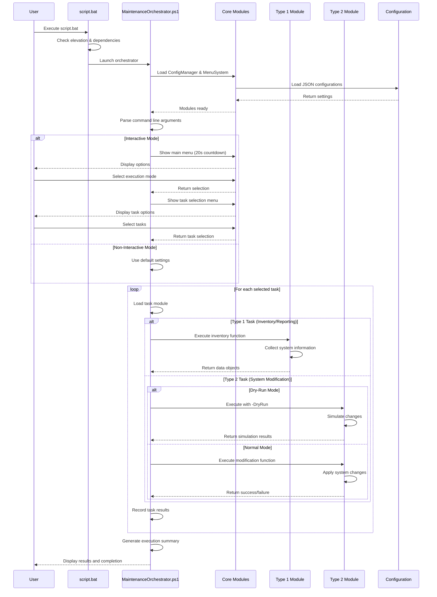
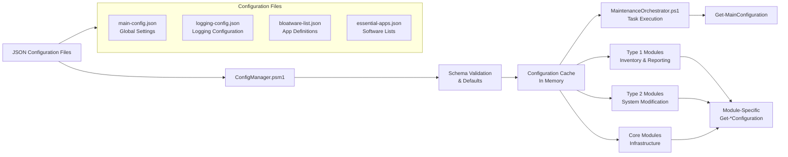

# Windows Maintenance Automation v2.1

A professional-grade Windows 10/11 maintenance system with enhanced logging infrastructure, session-based file organization, interactive dashboard reporting, and comprehensive system analytics.

For full details (architecture, modules, usage, testing, contributor guide), see sections below.

## ✨ Enhanced Features (v2.1)
- **🆕 Session-Based File Organization** - Eliminated file proliferation with structured temp_files directories and automatic cleanup
- **🆕 Professional Dashboard Reports** - Interactive HTML reports with Chart.js analytics, health scoring, and actionable recommendations
- **🆕 Centralized Logging System** - Structured logging with performance tracking, session management, and multi-format exports
- **🆕 Enterprise-Grade File Management** - Organized data storage with configurable retention policies and clean directory structures
- **🆕 System Health Analytics** - Comprehensive scoring with security assessment, resource analysis, and trend visualization
- **🆕 Performance Monitoring** - Real-time operation tracking, timing analysis, and optimization insights
- **🆕 Export Capabilities** - JSON, CSV, XML data exports for integration and compliance reporting

## Core Features
- Modular architecture: Type 1 (inventory/reporting) and Type 2 (system modification)
- Robust launcher: elevation, reboot-resume, monthly task, System Protection + restore point, dependency bootstrap
- Interactive and unattended modes with countdown menus and safe defaults
- Enhanced JSON configuration with advanced logging and reporting controls
- Mandatory TestFolder workflow for end-to-end testing

## Project structure

```
script_mentenanta/
├── script.bat
├── MaintenanceOrchestrator.ps1
├── modules/
│   ├── type1/
│   │   ├── SystemInventory.psm1
│   │   ├── BloatwareDetection.psm1
│   │   ├── SecurityAudit.psm1
│   │   └── ReportGeneration.psm1 (🆕 Enhanced with dashboard analytics)
│   ├── type2/
│   │   ├── BloatwareRemoval.psm1
│   │   ├── EssentialApps.psm1
│   │   ├── WindowsUpdates.psm1
│   │   ├── TelemetryDisable.psm1
│   │   └── SystemOptimization.psm1
│   └── core/
│       ├── ConfigManager.psm1
│       ├── MenuSystem.psm1
│       ├── DependencyManager.psm1
│       ├── LoggingManager.psm1 (🆕 Centralized logging system)
│       └── FileOrganizationManager.psm1 (🆕 Session-based file organization)
├── config/
│   ├── bloatware-list.json
│   ├── essential-apps.json
│   ├── main-config.json
│   └── logging-config.json (🆕 Enhanced with performance tracking)
├── temp_files/ (🆕 Organized session-based storage)
│   ├── session-YYYYMMDD-HHMMSS/
│   │   ├── logs/ (structured logging with module-specific files)
│   │   ├── data/ (categorized data: inventory/, apps/, security/)
│   │   ├── reports/ (final HTML, JSON, TXT reports)
│   │   └── temp/ (temporary processing files)
│   └── cleanup-policy.json (automatic cleanup configuration)
├── archive/
│   └── script-original.ps1 (legacy, reference only)
├── Enhanced-MaintenanceOrchestrator-Example.ps1 (🆕 Integration example)
└── ENHANCED-LOGGING-REPORTING-ANALYSIS.md (🆕 Comprehensive documentation)
```

## Launcher sequence (pre-orchestrator)
- Check admin; auto-elevate via UAC if needed
- Remove leftover startup task `WindowsMaintenanceStartup`
- Detect pending restart; if pending, create `WindowsMaintenanceStartup` (SYSTEM, Highest) and restart; resume and clean up after boot
- Ensure monthly task `WindowsMaintenanceAutomation` exists (1st, 01:00, SYSTEM, Highest) targeting `script.bat -NonInteractive`
- Ensure System Protection is enabled on system drive; create and verify a System Restore Point
- Bootstrap dependencies: PowerShell 7, winget, NuGet, PowerShellGet, PSWindowsUpdate, Chocolatey
- Launch `MaintenanceOrchestrator.ps1`

## Usage

Interactive (default):
- Countdown menus for execution mode and task selection; safe defaults after timeout

Non-interactive and dry-run examples:
```powershell
./MaintenanceOrchestrator.ps1 -NonInteractive
./MaintenanceOrchestrator.ps1 -DryRun -TaskNumbers "1,3,5"
```

Via launcher:
```powershell
./script.bat
./script.bat -NonInteractive
./script.bat -DryRun
./script.bat -TaskNumbers 1,3,5
```

## 🆕 File Organization System (v2.1)

The system now features **enterprise-grade file organization** that eliminates file proliferation and provides clean, structured data storage:

### Session-Based Organization
- **Unique session directories**: Each maintenance run creates `temp_files/session-YYYYMMDD-HHMMSS/`
- **No file duplication**: Session-based approach prevents multiple timestamped files
- **Clean structure**: Organized into `logs/`, `data/`, `reports/`, and `temp/` subdirectories

### Automatic Cleanup
- **Configurable retention**: Keep sessions for 30 days, logs for 14 days, reports for 90 days
- **Space management**: Automatic cleanup prevents disk space issues
- **Policy-driven**: Customizable cleanup rules via `cleanup-policy.json`

### Benefits Achieved
- ✅ **Eliminated file proliferation** - No more duplicate timestamped files
- ✅ **Populated logs directory** - Structured logging with module-specific files
- ✅ **Professional organization** - Clear categorization like enterprise systems
- ✅ **Easy debugging** - Logical separation of logs, data, and reports

## Tasks and modules

Type 1 (read-only):
- SystemInventory: Get-SystemInventory, Export-SystemInventory
- BloatwareDetection: Find-InstalledBloatware, Get-BloatwareStatistics, Test-BloatwareDetection
- SecurityAudit: Start-SecurityAudit, Get-WindowsDefenderStatus
- ReportGeneration: New-MaintenanceReport (🆕 Enhanced with interactive dashboard, Chart.js analytics, health scoring)

Type 2 (system changes):
- BloatwareRemoval: Remove-DetectedBloatware, Test-BloatwareRemoval
- EssentialApps: Install-EssentialApplications, Get-AppsNotInstalled, Get-InstallationStatistics
- WindowsUpdates: Install-WindowsUpdates, Get-WindowsUpdateStatus
- TelemetryDisable: Disable-WindowsTelemetry, Test-PrivacySettings
- SystemOptimization: Optimize-SystemPerformance, Get-SystemPerformanceMetrics

Conventions for Type 2 modules:
- [CmdletBinding(SupportsShouldProcess=$true)], respect -WhatIf/-Confirm and repo-wide -DryRun
- Return $true on success, $false on failure

## Configuration

- bloatware-list.json: detection/removal patterns
- essential-apps.json: curated app list for installation
- main-config.json: execution defaults and toggles
- logging-config.json: 🆕 Enhanced with structured logging, performance tracking, report generation settings, and alert thresholds

Example enhanced logging-config.json snippet:
```json
{
  "logging": {
    "enablePerformanceTracking": true,
    "enableStructuredLogging": true,
    "logBufferSize": 1000,
    "keepLogFiles": 10
  },
  "reporting": {
    "enableDashboardReports": true,
    "autoGenerateReports": true,
    "includePerformanceMetrics": true
  },
  "performance": {
    "trackOperationTiming": true,
    "slowOperationThreshold": 30.0,
    "criticalOperationThreshold": 60.0
  }
}
```

## Mandatory TestFolder workflow
Run end-to-end tests in a sibling `TestFolder` to simulate a fresh deployment.

```powershell
Remove-Item "C:\Users\Bogdan\OneDrive\Desktop\Projects\TestFolder\*" -Recurse -Force -ErrorAction SilentlyContinue
Copy-Item "C:\Users\Bogdan\OneDrive\Desktop\Projects\script_mentenanta\script.bat" "C:\Users\Bogdan\OneDrive\Desktop\Projects\TestFolder\" -Force
Set-Location "C:\Users\Bogdan\OneDrive\Desktop\Projects\TestFolder"
./script.bat
```

## 🆕 Enhanced Logging & Reporting (v2.0)

### New LoggingManager Module
- **Structured logging** with session tracking and operation IDs
- **Performance tracking** with Start/Complete-PerformanceTracking functions
- **Multi-destination output** (console, file, structured buffer)
- **Data export capabilities** (JSON, CSV, XML) for integration

### Enhanced Dashboard Reports
- **Interactive HTML reports** with Chart.js analytics
- **Health scoring system** with visual indicators
- **Real-time charts**: Task distribution, system resources, execution timeline, security radar
- **Actionable recommendations** with priority-based action items
- **Responsive design** with modern Microsoft Fluent styling

### Usage Examples
```powershell
# Initialize enhanced logging
Initialize-LoggingSystem -LoggingConfig $config

# Use structured logging
Write-LogEntry -Level 'INFO' -Component 'ORCHESTRATOR' -Message 'Starting maintenance'

# Track performance
$perf = Start-PerformanceTracking -OperationName 'BloatwareRemoval'
Complete-PerformanceTracking -PerformanceContext $perf -Success $true

# Generate enhanced reports
New-MaintenanceReport -SystemInventory $inventory -TaskResults $results
```

## Developer guide (quick)

- Task registry entries in `MaintenanceOrchestrator.ps1`: Name, Description, ModulePath, Function, Type, Category
- 🆕 Use `Write-LogEntry` for structured logging instead of Write-Host
- 🆕 Use `Start/Complete-PerformanceTracking` for operation timing
- Approved verbs only; advanced functions with comment-based help
- Validate parameters; avoid aliases; use ShouldProcess for destructive actions
- Use `Get-MainConfiguration` and JSON files for settings; don't hardcode
- Wrap external tools safely; check exit codes; log errors
- Run `Invoke-ScriptAnalyzer -Path . -Recurse` before commits

## Support and license

- Issues: open on GitHub with `maintenance.log` attached when relevant
- License: MIT (see LICENSE)

---

Made for reliable Windows maintenance and easy extensibility.

## Quick instructions (AI assistants)

Use this README as the single source of truth. When editing code:

- Follow module contracts: Type 1 returns data; Type 2 changes state and uses ShouldProcess, returns $true/$false
- Don’t duplicate launcher logic (elevation, scheduled tasks, System Protection, restore point, dependencies)
- Load config via ConfigManager from `config/*.json` (no hardcoding)
- Respect `-DryRun`, `-WhatIf`, `-Confirm` everywhere destructive
- Keep functions small, use approved verbs, add comment-based help
- Wrap external commands safely and check ExitCode
- Run `Invoke-ScriptAnalyzer -Path . -Recurse` before committing

Required testing workflow (always):
1) Clean TestFolder
2) Copy latest `script.bat` there
3) Run from TestFolder and observe bootstrap, tasks, restore point, orchestrator

Implementation checklist:
- Add new tasks in `MaintenanceOrchestrator.ps1` (Name, Description, ModulePath, Function, Type, Category)
- Export functions in modules and respect return contracts
- Use JSON config, log clearly, and guard all destructive actions with ShouldProcess

## Architecture diagrams

### System Architecture Overview

```mermaid
graph TB
  %% Entry Points
  User[👤 User] --> Launcher[script.bat<br/>Enhanced Launcher]
  User --> Direct[MaintenanceOrchestrator.ps1<br/>Direct Execution]
    
  %% Launcher Flow
  Launcher --> ElevCheck{Administrator<br/>Check}
  ElevCheck -->|Not Elevated| UAC[Request UAC<br/>Elevation]
  ElevCheck -->|Elevated| DepMgr[Dependency<br/>Bootstrap]
  UAC --> DepMgr
    
  %% Dependency Bootstrap
  DepMgr --> PS7{PowerShell 7<br/>Available?}
  PS7 -->|No| InstallPS7[Install PowerShell 7<br/>via winget/GitHub]
  PS7 -->|Yes| WinGet{winget<br/>Available?}
  InstallPS7 --> WinGet
  WinGet -->|No| InstallWinGet[Install App Installer<br/>Microsoft Store/GitHub]
  WinGet -->|Yes| NuGet{NuGet Provider<br/>Available?}
  InstallWinGet --> NuGet
  NuGet -->|No| InstallNuGet[Install NuGet Provider<br/>PowerShell Gallery]
  NuGet -->|Yes| PSWinUpdate{PSWindowsUpdate<br/>Available?}
  InstallNuGet --> PSWinUpdate
  PSWinUpdate -->|No| InstallPSWU[Install PSWindowsUpdate<br/>PowerShell Gallery]
  PSWinUpdate -->|Yes| Choco{Chocolatey<br/>Available?}
  InstallPSWU --> Choco
  Choco -->|No| InstallChoco[Install Chocolatey<br/>chocolatey.org]
  Choco -->|Yes| LaunchOrch[Launch Orchestrator]
  InstallChoco --> LaunchOrch
    
  %% Direct execution joins here
  Direct --> LaunchOrch
    
  %% Orchestrator Flow
  LaunchOrch --> Orchestrator[MaintenanceOrchestrator.ps1<br/>Central Coordinator]
  Orchestrator --> LoadCore[Load Core Modules]
  LoadCore --> LoadConfig[Initialize Configuration]
  LoadConfig --> ParseArgs[Parse Command Line<br/>Arguments]
    
  %% Menu System
  ParseArgs --> Interactive{Interactive<br/>Mode?}
  Interactive -->|Yes| MainMenu[Show Main Menu<br/>20s Countdown]
  Interactive -->|No| NonInt[Non-Interactive<br/>Execution]
  MainMenu --> ExecMode{Execution<br/>Mode?}
  ExecMode -->|Execute| TaskMenu[Show Task Menu<br/>All/Specific Tasks]
  ExecMode -->|DryRun| TaskMenuDR[Show Task Menu<br/>Dry-Run Mode]
  TaskMenu --> TaskExec[Task Execution]
  TaskMenuDR --> TaskExecDR[Task Execution<br/>Dry-Run Mode]
  NonInt --> TaskExec
    
  %% Core Modules
  subgraph CoreMods[Core Infrastructure Modules]
    ConfigMgr[ConfigManager.psm1<br/>Configuration Management]
    MenuSys[MenuSystem.psm1<br/>Interactive Menus]
    DepMgrMod[DependencyManager.psm1<br/>Package Management]
  end
    
  LoadCore --> CoreMods
    
  %% Task Execution Engine
  TaskExec --> TaskRegistry[Task Registry<br/>$Tasks Array]
  TaskExecDR --> TaskRegistry
  TaskRegistry --> LoadMod[Load Task Module<br/>On-Demand]
    
  %% Module Types
  LoadMod --> ModType{Module<br/>Type?}
  ModType -->|Type 1| Type1Mods[Type 1: Inventory & Reporting]
  ModType -->|Type 2| Type2Mods[Type 2: System Modification]
    
  %% Type 1 Modules (Inventory & Reporting)
  subgraph Type1[Type 1 Modules - Read-Only Operations]
    SysInv[SystemInventory.psm1<br/>System Information]
    BloatDet[BloatwareDetection.psm1<br/>Bloatware Scanning]
    SecAudit[SecurityAudit.psm1<br/>Security Analysis]
    RepGen[ReportGeneration.psm1<br/>HTML/Text Reports]
  end
    
  Type1Mods --> Type1
    
  %% Type 2 Modules (System Modification)
  subgraph Type2[Type 2 Modules - System Changing Operations]
    BloatRem[BloatwareRemoval.psm1<br/>Application Removal]
    EssApps[EssentialApps.psm1<br/>Application Installation]
    WinUpd[WindowsUpdates.psm1<br/>Update Management]
    TelDis[TelemetryDisable.psm1<br/>Privacy Hardening]
    SysOpt[SystemOptimization.psm1<br/>Performance Tuning]
  end
    
  Type2Mods --> Type2
    
  %% Configuration System
  subgraph ConfigSys[Configuration System - JSON Files]
    MainConf[main-config.json<br/>Global Settings]
    LogConf[logging-config.json<br/>Logging Configuration]
    BloatConf[bloatware-list.json<br/>Definitions]
    AppConf[essential-apps.json<br/>Application Lists]
  end
    
  ConfigMgr --> ConfigSys
    
  %% Output and Reporting
  Type1 --> DataOut[Data Objects<br/>System Information]
  Type2 --> BoolOut[Success/Failure<br/>Boolean Results]
  DataOut --> Reports[Generated Reports<br/>temp_files/reports/]
  BoolOut --> Logging[Operation Logs<br/>temp_files/logs/]
    
  %% Task Results
  Reports --> Results[Task Results<br/>Summary & Details]
  Logging --> Results
  Results --> Complete[Maintenance<br/>Complete]
```



### Module Interaction Flow



### Configuration Flow



## Module Guide (full)

- Core modules: ConfigManager (Initialize-ConfigSystem, Get/Save-*Configuration), MenuSystem (Show-*Menu, Start-CountdownSelection), DependencyManager (Install-AllDependencies, Get-DependencyStatus)
- Type 1 modules (read-only):
  - SystemInventory: Get-SystemInventory, Export-SystemInventory
  - BloatwareDetection: Find-InstalledBloatware, Get-BloatwareStatistics, Test-BloatwareDetection
  - ReportGeneration: New-MaintenanceReport
  - SecurityAudit: Start-SecurityAudit, Get-WindowsDefenderStatus
- Type 2 modules (system-changing):
  - BloatwareRemoval: Remove-DetectedBloatware, Test-BloatwareRemoval
  - EssentialApps: Install-EssentialApplications, Get-AppsNotInstalled, Get-InstallationStatistics
  - WindowsUpdates: Install-WindowsUpdates, Get-WindowsUpdateStatus
  - TelemetryDisable: Disable-WindowsTelemetry, Test-PrivacySettings
  - SystemOptimization: Optimize-SystemPerformance, Get-SystemPerformanceMetrics

Contracts:
- Type 1: return data objects
- Type 2: [CmdletBinding(SupportsShouldProcess=$true)], respect -WhatIf/-Confirm and repo-wide -DryRun, return $true/$false

## PowerShell best practices (project-specific)

- Use approved verbs: Get, Set, New, Remove, Add, Install, Uninstall, Test, Start, Stop, Enable, Disable, Invoke, Export, Import
- Advanced functions with CmdletBinding and comment-based help
- Parameter validation; avoid aliases; prefer named parameters
- Destructive actions: ShouldProcess with WhatIf/Confirm
- Wrap external commands; check ExitCode; log errors
- Keep functions small and single-responsibility
- Run `Invoke-ScriptAnalyzer -Path . -Recurse` before committing

Example header template:

```powershell
function Get-Example {
  [CmdletBinding(SupportsShouldProcess=$true, ConfirmImpact='Medium')]
  param(
    [Parameter(Mandatory=$true, Position=0)]
    [string]$Name,

    [Parameter()]
    [switch]$WhatIf
  )

  <#
  .SYNOPSIS
  Short description.

  .DESCRIPTION
  Longer description.

  .PARAMETER Name
  The target name.

  .EXAMPLE
  Get-Example -Name 'foo'
  #>

  if ($PSCmdlet.ShouldProcess($Name, 'Read')) {
    try {
      # Implementation here
      return $true
    }
    catch {
      Write-Error "Get-Example failed: $_"
      return $false
    }
  }
}
```

Splatting example:

```powershell
$args = @('--silent','--accept-package-agreements','--accept-source-agreements')
Start-Process -FilePath 'winget.exe' -ArgumentList $args -Wait -NoNewWindow
```

---

## 📋 Version Information

**Version**: 2.1 - Enhanced File Organization System  
**Last Updated**: October 12, 2025  
**Key Features**: Session-based file organization, enterprise-grade logging, interactive dashboard reports  

### Recent Enhancements (v2.1)
- **FileOrganizationManager**: Session-based file organization eliminates file proliferation
- **Structured temp_files**: Professional directory organization with automatic cleanup
- **Enhanced logging**: Module-specific logs and performance tracking
- **Testing suite**: Comprehensive validation with Test-ComprehensiveFileOrganization.ps1
- **Documentation**: Complete guides for file organization and system architecture
