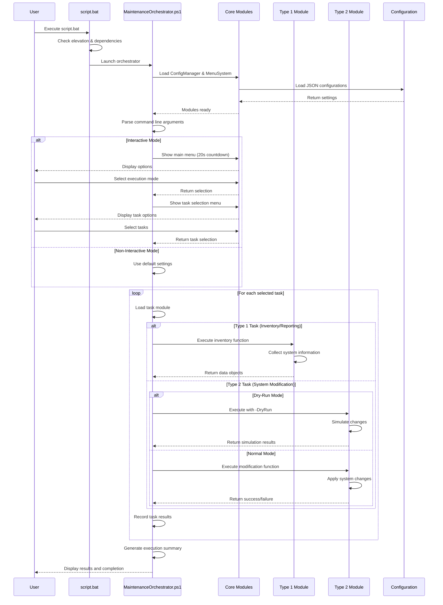
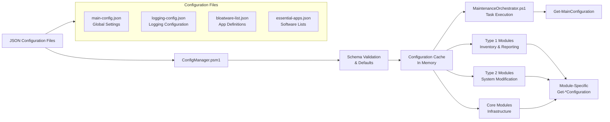

# Windows Maintenance Automation v3.0

🚀 **Enterprise-grade Windows 10/11 maintenance system** with hierarchical interactive menus, self-contained modular architecture, global path discovery, and comprehensive before/after reporting.

**🎉 Latest Update (v3.0 - October 2025)**: Revolutionary architecture with Type1→Type2 flow, consolidated core infrastructure (29 functions), global `-Global` scope imports, session-based file organization, external template system, and diagnostic-driven development.

## 🎯 **System Purpose & Architecture Overview**

This automated Windows maintenance system performs comprehensive system cleanup, optimization, and security hardening through a **strict separation of detection (Type1) from action (Type2)**. The system ensures safe, reversible operations with detailed logging and comprehensive reporting.

### **Core Objectives**
- 🗑️ **Remove bloatware** - Uninstall 187+ unwanted pre-installed applications
- 📦 **Install essential apps** - Deploy 10+ missing productivity applications
- ⚡ **Optimize performance** - Apply registry/service tweaks for faster operation
- 🔒 **Disable telemetry** - Block privacy-invasive Windows data collection
- 🔄 **Install updates** - Apply critical Windows security patches
- 📊 **Generate reports** - Create comprehensive before/after HTML dashboards

### **Key Architecture Principles**
1. **Type1 Detection First** - Always scan before taking action
2. **Diff-Based Execution** - Only process items found in (detected ∩ config)
3. **DryRun Support** - All operations support simulation mode
4. **Session Isolation** - Organized temp_files/ structure per execution
5. **Global Path Discovery** - Portable execution from any location
6. **Standardized Returns** - Consistent result objects for reporting

### **📚 Documentation**
- **[Complete Module Development Guide](ADDING_NEW_MODULES.md)** - 883-line guide for adding new Type2 modules
- **[Quick Development Reference](.github/MODULE_DEVELOPMENT_GUIDE.md)** - 10-step condensed procedure
- **[Copilot Instructions](.github/copilot-instructions.md)** - AI agent guidelines with diagnostic-driven development
- **[Contributing Guide](.github/CONTRIBUTING.md)** - Development setup and coding standards

## 🔄 **Complete Execution Logic & Workflow**

### **Phase 1: Bootstrap & Initialization**
```
🚀 script.bat (Launcher)
├── 🔐 Check/Request Administrator Privileges
├── 🔄 Handle Pending System Restart (auto-resume via scheduled task)
├── 🛡️ Create System Restore Point + Enable System Protection
├── 📦 Bootstrap Dependencies (PowerShell 7, winget, Chocolatey)
├── ⏰ Setup Monthly Automation Task (SYSTEM account)
└── 🎯 Launch MaintenanceOrchestrator.ps1
```

### **Phase 2: System Discovery & Module Loading**
```
🎯 MaintenanceOrchestrator.ps1
├── 🔍 Global Path Discovery
│   ├── Set Environment Variables:
│   │   ├── MAINTENANCE_PROJECT_ROOT → script_mentenanta/
│   │   ├── MAINTENANCE_CONFIG_ROOT → script_mentenanta/config/
│   │   ├── MAINTENANCE_MODULES_ROOT → script_mentenanta/modules/
│   │   ├── MAINTENANCE_TEMP_ROOT → script_mentenanta/temp_files/
│   │   └── MAINTENANCE_REPORTS_ROOT → script_mentenanta/
│   └── 📂 Create Session Directories:
│       ├── temp_files/data/ (Type1 detection results)
│       ├── temp_files/logs/ (Type2 execution logs)
│       ├── temp_files/temp/ (processing diffs)
│       └── temp_files/reports/ (temporary report data)
│
├── 🧩 Load Core Modules (Orchestrator-managed):
│   ├── CoreInfrastructure.psm1 (16 functions)
│   │   ├── Configuration Management (5 functions)
│   │   ├── Logging System (5 functions)
│   │   └── File Organization (6 functions)
│   ├── UserInterface.psm1 (hierarchical menus)
│   └── ReportGeneration.psm1 (HTML report generation)
│
└── 📦 Load Type2 Modules (Self-contained):
    ├── BloatwareRemoval.psm1 → internally imports BloatwareDetectionAudit.psm1
    ├── EssentialApps.psm1 → internally imports EssentialAppsAudit.psm1
    ├── SystemOptimization.psm1 → internally imports SystemOptimizationAudit.psm1
    ├── TelemetryDisable.psm1 → internally imports TelemetryAudit.psm1
    └── WindowsUpdates.psm1 → internally imports WindowsUpdatesAudit.psm1
```

### **Phase 3: Configuration & Session Setup**
```
⚙️ Configuration Loading
├── 📋 Load Configurations from config/:
│   ├── main-config.json (execution modes, module toggles)
│   ├── logging-config.json (log levels, destinations)
│   ├── bloatware-list.json (187 applications to remove)
│   ├── essential-apps.json (10 applications to install)
│   └── report-templates-config.json (report structure)
│
└── 🔧 Initialize Systems:
    ├── Configuration Management System
    ├── Structured Logging System
    ├── File Organization System
    └── Session ID Generation (GUID + timestamp)
```

### **Phase 4: Interactive User Interface**
```
🖥️ Hierarchical Menu System (20-second countdowns)
├── Main Menu:
│   ├── [1] Execute normally (DEFAULT - auto-selected)
│   └── [2] Dry-run mode (simulation only)
│
└── Sub Menu (per main selection):
    ├── [1] Execute all tasks (DEFAULT - auto-selected)
    └── [2] Execute specific task numbers (comma-separated input)
```

### **Phase 5: Task Execution Engine**
```
🚀 Task Execution (Fixed Sequence)
├── Task 1: 🗑️ BloatwareRemoval
│   ├── Type1: BloatwareDetectionAudit.psm1
│   │   ├── 🔍 Scan installed applications
│   │   ├── 📋 Compare against bloatware-list.json (187 items)
│   │   ├── 💾 Save results → temp_files/data/bloatware-results.json
│   │   └── ↩️ Return detected items to Type2
│   └── Type2: BloatwareRemoval.psm1
│       ├── 🎯 Create diff (config items found on system)
│       ├── 💾 Save diff → temp_files/temp/bloatware-diff.json
│       ├── 🗑️ Uninstall applications (if not dry-run)
│       ├── 📝 Log execution → temp_files/logs/bloatware-removal/execution.log
│       └── ↩️ Return result summary
│
├── Task 2: 📦 EssentialApps
│   ├── Type1: EssentialAppsAudit.psm1
│   │   ├── 🔍 Scan installed applications
│   │   ├── 📋 Compare against essential-apps.json (10 items)
│   │   ├── 💾 Save results → temp_files/data/essential-apps-results.json
│   │   └── ↩️ Return missing applications to Type2
│   └── Type2: EssentialApps.psm1
│       ├── 🎯 Create diff (missing apps from config)
│       ├── 💾 Save diff → temp_files/temp/essential-apps-diff.json
│       ├── 📦 Install applications via winget/chocolatey (if not dry-run)
│       ├── 📝 Log execution → temp_files/logs/essential-apps/execution.log
│       └── ↩️ Return installation summary
│
├── Task 3: ⚡ SystemOptimization
│   ├── Type1: SystemOptimizationAudit.psm1
│   │   ├── 🔍 Scan system settings, registry, services
│   │   ├── 📋 Identify optimization opportunities
│   │   ├── 💾 Save results → temp_files/data/system-optimization-results.json
│   │   └── ↩️ Return optimization items to Type2
│   └── Type2: SystemOptimization.psm1
│       ├── 🎯 Create diff (optimizations to apply)
│       ├── 💾 Save diff → temp_files/temp/system-optimization-diff.json
│       ├── ⚡ Apply registry changes, service configs (if not dry-run)
│       ├── 📝 Log execution → temp_files/logs/system-optimization/execution.log
│       └── ↩️ Return optimization summary
│
├── Task 4: 🔒 TelemetryDisable
│   ├── Type1: TelemetryAudit.psm1
│   │   ├── 🔍 Scan telemetry settings, scheduled tasks, services
│   │   ├── 📋 Identify active data collection
│   │   ├── 💾 Save results → temp_files/data/telemetry-results.json
│   │   └── ↩️ Return active telemetry items to Type2
│   └── Type2: TelemetryDisable.psm1
│       ├── 🎯 Create diff (telemetry items to disable)
│       ├── 💾 Save diff → temp_files/temp/telemetry-diff.json
│       ├── 🔒 Disable telemetry services, tasks, registry (if not dry-run)
│       ├── 📝 Log execution → temp_files/logs/telemetry-disable/execution.log
│       └── ↩️ Return privacy changes summary
│
└── Task 5: 🔄 WindowsUpdates
    ├── Type1: WindowsUpdatesAudit.psm1
    │   ├── 🔍 Scan for available updates
    │   ├── 📋 Check update service status
    │   ├── 💾 Save results → temp_files/data/windows-updates-results.json
    │   └── ↩️ Return available updates to Type2
    └── Type2: WindowsUpdates.psm1
        ├── 🎯 Create diff (updates to install)
        ├── 💾 Save diff → temp_files/temp/windows-updates-diff.json
        ├── 🔄 Install updates (if not dry-run)
        ├── 📝 Log execution → temp_files/logs/windows-updates/execution.log
        └── ↩️ Return update summary
```

### **Phase 6: Report Generation**
```
📊 Report Generation
├── 📁 Collect Data:
│   ├── Detection Results: temp_files/data/*.json
│   ├── Execution Logs: temp_files/logs/*/execution.log
│   ├── Processing Diffs: temp_files/temp/*-diff.json
│   └── System Information: Hardware, OS, Security status
│
├── 🎨 Generate Report:
│   ├── Load Templates: config/report-template.html, task-card-template.html
│   ├── Apply Styling: config/report-styles.css
│   ├── Module Configuration: config/report-templates-config.json
│   └── Create Before/After Comparisons for each module
│
└── 💾 Save Reports:
    ├── All Reports: temp_files/reports/ (HTML, JSON, TXT, Summary)
    ├── Main HTML Copy: Parent Directory (Documents/Desktop/USB root)
    └── Format: MaintenanceReport_YYYY-MM-DD_HH-mm-ss.html
```

## 🏗️ **Detailed Architecture**

## 🏗️ **Detailed Architecture**

### **🎯 Module Organization & Dependencies**
```
📁 script_mentenanta/
├── 🚀 script.bat                           # Bootstrap launcher with admin elevation
├── 🎯 MaintenanceOrchestrator.ps1          # Central coordination engine (1,126 lines)
├── 📁 config/                              # Configuration & Templates
│   ├── 📋 main-config.json                 # Execution modes, module toggles, paths
│   ├── 📊 logging-config.json              # Log levels, destinations, performance
│   ├── 🗑️ bloatware-list.json              # 187 applications to remove
│   ├── 📦 essential-apps.json              # 10 applications to install
│   ├── 📈 report-generation-config.json    # Report dashboard settings
│   ├── 🎨 report-template.html             # Main HTML report template
│   ├── 📄 task-card-template.html          # Module report template
│   ├── 🎨 report-styles.css                # Report styling (no charts)
│   └── ⚙️ report-templates-config.json     # Module icons & metadata
├── 📁 modules/
│   ├── 📁 core/                            # Essential Infrastructure (Orchestrator-loaded)
│   │   ├── 🏗️ CoreInfrastructure.psm1      # Config + Logging + File Org (16 functions)
│   │   ├── 🖥️ UserInterface.psm1           # Hierarchical menus + countdown timers
│   │   ├── 📊 ReportGeneration.psm1        # HTML dashboard generation
│   │   ├── 🛠️ CommonUtilities.psm1         # Shared fallback functions
│   │   ├── 📦 DependencyManager.psm1       # External package management
│   │   └── 🔍 SystemAnalysis.psm1          # System inventory & security audit
│   ├── 📁 type1/                           # Detection & Audit Modules (Type1)
│   │   ├── 🗑️ BloatwareDetectionAudit.psm1 # Scan & detect unwanted apps
│   │   ├── 📦 EssentialAppsAudit.psm1      # Identify missing essential apps
│   │   ├── ⚡ SystemOptimizationAudit.psm1  # Find optimization opportunities
│   │   ├── 🔒 TelemetryAudit.psm1          # Detect active telemetry/tracking
│   │   └── 🔄 WindowsUpdatesAudit.psm1     # Check for available updates
│   └── 📁 type2/                           # Action & Modification Modules (Type2)
│       ├── 🗑️ BloatwareRemoval.psm1        # Remove unwanted applications
│       ├── 📦 EssentialApps.psm1           # Install missing applications
│       ├── ⚡ SystemOptimization.psm1      # Apply performance optimizations
│       ├── 🔒 TelemetryDisable.psm1        # Disable privacy-invasive features
│       └── 🔄 WindowsUpdates.psm1          # Install Windows updates
└── 📁 temp_files/                          # Session-based Organized Storage
    ├── 📁 data/                            # Type1 Detection Results (JSON)
    │   ├── 🗑️ bloatware-results.json       # BloatwareDetectionAudit findings
    │   ├── 📦 essential-apps-results.json  # EssentialAppsAudit findings
    │   ├── ⚡ system-optimization-results.json # SystemOptimizationAudit findings
    │   ├── 🔒 telemetry-results.json       # TelemetryAudit findings
    │   └── 🔄 windows-updates-results.json # WindowsUpdatesAudit findings
    ├── 📁 logs/                            # Type2 Execution Logs (Dedicated dirs)
    │   ├── 📁 bloatware-removal/execution.log
    │   ├── 📁 essential-apps/execution.log
    │   ├── 📁 system-optimization/execution.log
    │   ├── 📁 telemetry-disable/execution.log
    │   └── 📁 windows-updates/execution.log
    ├── 📁 temp/                            # Processing Diffs & Intermediate Data
    │   ├── 🗑️ bloatware-diff.json          # Config items found on system
    │   ├── 📦 essential-apps-diff.json     # Missing apps from config
    │   ├── ⚡ system-optimization-diff.json # Optimizations ready for execution
    │   ├── 🔒 telemetry-diff.json          # Active telemetry items
    │   └── 🔄 windows-updates-diff.json    # Available updates
    └── 📁 reports/                         # Temporary report data
```

### **🔄 Type1 → Type2 Execution Pattern**
Each maintenance task follows this standardized pattern:

**1. Type1 Detection Phase:**
```powershell
# Example: BloatwareDetectionAudit.psm1
function Get-BloatwareAnalysis {
    # 🔍 Scan system for installed applications
    # 📋 Load bloatware-list.json (187 items)
    # 🎯 Compare installed vs config list
    # 💾 Save results to temp_files/data/bloatware-results.json
    # ↩️ Return detected items to Type2 module
}
```

**2. Type2 Action Phase:**
```powershell
# Example: BloatwareRemoval.psm1
function Invoke-BloatwareRemoval {
    # 📥 Import BloatwareDetectionAudit.psm1 internally
    # 🔍 Call Get-BloatwareAnalysis for detection
    # 🎯 Create diff: only items from config found on system
    # 💾 Save diff to temp_files/temp/bloatware-diff.json
    # 🗑️ Process ONLY items in diff list (if not dry-run)
    # 📝 Log execution to temp_files/logs/bloatware-removal/
    # ↩️ Return standardized result object
}
```

### **🛠️ Type2 Execution Modes & Operating System Modifications**

Type2 modules operate in two distinct modes that determine whether **actual OS modifications** occur:

#### **🧪 DryRun Mode (Simulation Only)**
```powershell
# When DryRun flag is enabled:
if ($DryRun) {
    Write-LogEntry "DRY-RUN: Would remove king.com.CandyCrushSaga"
    $processedCount = 0  # Simulated count
    # ⚠️ NO ACTUAL CHANGES MADE TO OPERATING SYSTEM
}
```

**DryRun Mode Characteristics:**
- 🔍 **Full Detection**: Type1 modules scan and detect normally
- 📊 **Analysis Creation**: Diff lists are generated normally  
- 📝 **Simulation Logging**: Actions are logged as "would be performed"
- ❌ **No OS Changes**: Zero modifications to Windows system
- ✅ **Safe Testing**: Perfect for testing configurations

#### **🚀 Live Execution Mode (Real OS Modifications)**
```powershell
# When DryRun is NOT enabled:
if (-not $DryRun) {
    # ⚠️ REAL OPERATING SYSTEM MODIFICATIONS OCCUR
    $result = Remove-DetectedBloatware -BloatwareList $diffList
}
```

**Live Mode - ACTUAL Operating System Changes:**

**🗑️ BloatwareRemoval Module:**
- **AppX Package Removal**: `Remove-AppxPackage` - Permanently deletes UWP/Modern apps
- **Provisioned Package Removal**: `Remove-AppxProvisionedPackage` - Prevents app reinstallation
- **Winget Uninstallation**: `winget uninstall --id <package>` - Removes programs via Package Manager
- **Chocolatey Uninstallation**: `choco uninstall <package>` - Removes programs via Chocolatey
- **Registry-Based Removal**: Executes native uninstallers via registry uninstall strings
- **File System Impact**: Deletes application files, folders, and user data
- **Registry Modifications**: Removes uninstall keys, file associations, and app registrations

**📦 EssentialApps Module:**
- **Winget Installation**: `winget install --id <package>` - Installs missing applications
- **Chocolatey Installation**: `choco install <package>` - Installs via Chocolatey repository
- **File System Impact**: Downloads and installs executable files and dependencies
- **Registry Modifications**: Registers new applications and file associations
- **Start Menu Updates**: Adds new applications to Windows Start Menu

**⚡ SystemOptimization Module:**
- **Registry Modifications**: Direct registry key/value creation and modification
- **Service Configuration**: `Set-Service` - Changes Windows service startup types and states
- **Scheduled Task Management**: Creates, modifies, or disables scheduled tasks
- **Power Settings**: Modifies Windows power plans and energy settings
- **Visual Effects**: Changes Windows visual effects and performance settings
- **Network Configuration**: Optimizes network adapter settings and protocols

**🔒 TelemetryDisable Module:**
- **Service Disabling**: `Set-Service -StartupType Disabled` - Disables telemetry services
- **Scheduled Task Disabling**: `Disable-ScheduledTask` - Stops data collection tasks
- **Registry Privacy Settings**: Sets privacy-related registry values
- **Group Policy Modifications**: Applies local group policy settings
- **Windows Features**: Disables optional Windows features related to data collection
- **Firewall Rules**: Creates outbound firewall rules to block telemetry endpoints

**🔄 WindowsUpdates Module:**
- **Update Installation**: `Install-WindowsUpdate` - Downloads and installs system updates
- **Update Service Configuration**: Configures Windows Update service settings
- **Reboot Scheduling**: May schedule system restarts for update completion
- **System File Modifications**: Updates system files, drivers, and components
- **Security Patches**: Applies critical security updates and hotfixes

#### **🛡️ Safety Mechanisms for OS Modifications**

**Pre-Execution Validation:**
- **Administrator Privilege Check**: All destructive operations require admin rights
- **Diff-Based Execution**: Only processes items matching BOTH detection AND configuration
- **System Restore Point**: Created before any modifications (via script.bat)
- **Configuration Validation**: Ensures valid config files before proceeding

**During Execution Protection:**
- **Error Isolation**: Each item processed individually with error handling
- **Transaction Logging**: Every action logged with timestamps and results
- **Rollback Data**: Removal details saved for potential restoration
- **Progress Tracking**: Real-time status updates for monitoring

**Post-Execution Audit:**
- **Comprehensive Logging**: All actions logged to temp_files/logs/
- **Before/After Comparison**: Detailed reports showing exact changes made
- **Execution Summary**: Success/failure counts for each module
- **Error Documentation**: Failed operations documented with error messages

#### **🔍 Data Types Processed by Type2 Modules**

**Detection Data Structure (from Type1):**
```json
{
  "Name": "king.com.CandyCrushSaga",
  "Source": "AppX",
  "DisplayName": "Candy Crush Saga", 
  "Publisher": "King",
  "Version": "1.2.3.4",
  "InstallPath": "C:\\Program Files\\WindowsApps\\...",
  "Size": "125MB",
  "MatchedPattern": "king.com.CandyCrush*",
  "Category": "Gaming"
}
```

**Diff Analysis (Configuration Match):**
```json
{
  "ItemsToProcess": [
    {
      "DetectedItem": { /* detection data */ },
      "ConfigPattern": "king.com.CandyCrush*",
      "Action": "Remove",
      "Method": "AppX-Package-Removal",
      "EstimatedImpact": "125MB freed"
    }
  ]
}
```

**Execution Result (Standardized Return):**
```json
{
  "Success": true,
  "ItemsDetected": 15,
  "ItemsProcessed": 3,
  "DiffPath": "temp_files/temp/bloatware-diff.json",
  "ExecutionLogPath": "temp_files/logs/bloatware-removal/execution.log",
  "Duration": 45.23
}
```

**⚠️ IMPORTANT**: When NOT in DryRun mode, Type2 modules **PERMANENTLY MODIFY THE WINDOWS OPERATING SYSTEM**. This includes software removal, installation, registry changes, service modifications, and system configuration updates. These changes are real and affect the running Windows environment.

### **🎛️ Function Purpose & Execution Sequence**

**Core Infrastructure Functions (CoreInfrastructure.psm1):**
- `Initialize-GlobalPathDiscovery()` → Set up project-wide path variables
- `Initialize-ConfigSystem()` → Load all JSON configurations
- `Get-MainConfig()` → Access main execution settings
- `Get-BloatwareList()` → Load bloatware application definitions
- `Get-UnifiedEssentialAppsList()` → Load essential application definitions
- `Initialize-LoggingSystem()` → Set up structured logging
- `Write-LogEntry()` → Structured logging with levels and components
- `Start-PerformanceTracking()` → Begin operation timing
- `Complete-PerformanceTracking()` → End operation timing
- `Initialize-FileOrganization()` → Set up session directories
- `Get-SessionPath()` → Get organized file paths
- `Save-SessionData()` → Store data in organized structure
- `Get-SessionData()` → Retrieve stored session data

**User Interface Functions (UserInterface.psm1):**
- `Show-MaintenanceMenu()` → Display hierarchical countdown menus
- `Get-UserExecutionMode()` → Get execution mode (normal/dry-run)
- `Get-UserTaskSelection()` → Get task selection (all/specific)
- `Show-ConfirmationDialog()` → Final confirmation before execution
- `Show-ExecutionSummary()` → Display task completion summary

**Report Generation Functions (ReportGeneration.psm1):**
- `Get-HtmlTemplates()` → Load external templates from config/
- `New-MaintenanceReport()` → Generate comprehensive HTML report
- `Get-ModuleExecutionData()` → Collect data from all temp_files/
- `Convert-ModuleDataToTaskResults()` → Format data for reporting

**Type2 Module Standard Functions:**
Each Type2 module exports exactly one function following this pattern:
- `Invoke-BloatwareRemoval()` → Remove unwanted applications
- `Invoke-EssentialApps()` → Install missing applications  
- `Invoke-SystemOptimization()` → Apply performance optimizations
- `Invoke-TelemetryDisable()` → Disable privacy-invasive features
- `Invoke-WindowsUpdates()` → Install Windows updates

### **� Module Import/Export Logic & Dependencies**

#### **CoreInfrastructure.psm1 (29 Exported Functions)**

**Imports:** None (base module)

**Exports:**
```powershell
# Path Discovery (3 functions)
- Initialize-GlobalPathDiscovery  # Set $Global:ProjectPaths with auto-detection
- Get-MaintenanceProjectPath      # Return project root directory  
- Get-MaintenanceModulePath       # Return specific module directory path

# Configuration Management (5 functions)
- Initialize-ConfigSystem         # Load all JSON configs from config/
- Get-MainConfig                  # Return main-config.json settings
- Get-BloatwareList               # Return bloatware-list.json (187 apps)
- Get-UnifiedEssentialAppsList    # Return essential-apps.json (10 apps)
- Get-LoggingConfiguration        # Return logging-config.json settings

# Logging System (9 functions)
- Initialize-LoggingSystem        # Set up structured logging with levels
- Get-VerbositySettings           # Get current logging verbosity
- Test-ShouldLogOperation         # Check if operation should be logged
- Write-LogEntry                  # Main logging function (INFO/WARN/ERROR/DEBUG)
- Write-OperationStart            # Log operation beginning
- Write-OperationSuccess          # Log successful completion
- Write-OperationFailure          # Log error with stack trace
- Write-OperationSkipped          # Log skipped operations
- Write-DetectionLog              # Log Type1 detection results

# Performance Tracking (2 functions)
- Start-PerformanceTracking       # Begin timing with operation context
- Complete-PerformanceTracking    # End timing and calculate duration

# File Organization (10 functions)
- Initialize-FileOrganization     # Create session directory structure
- Get-SessionPath                 # Get organized path for data/logs/temp/reports
- Initialize-TempFilesStructure   # Create temp_files/ subdirectories
- Initialize-ProcessedDataStructure # Initialize processed data storage
- Save-SessionData                # Save data to organized location
- Get-SessionData                 # Retrieve stored session data
- Get-BloatwareConfiguration      # Load bloatware config with validation
- Get-EssentialAppsConfiguration  # Load essential apps config with validation
- Save-OrganizedFile              # Save file to organized structure
- Get-ProcessedDataPath           # Get path for processed data files
```

**Global Variables Created:**
- `$Global:ProjectPaths` - Hashtable with Root, Config, Modules, TempFiles, ParentDir
- `$Global:MaintenanceSession` - Session ID, Timestamp, Directories

**Used By:** All modules (imported with `-Global` flag)

#### **UserInterface.psm1 (7 Exported Functions)**

**Imports:**
- CoreInfrastructure.psm1 (for logging and configuration)

**Exports:**
```powershell
- Show-MainMenu                   # Hierarchical main menu (Normal/DryRun)
- Show-TaskSelectionMenu          # Hierarchical sub menu (All/Specific)
- Show-ConfirmationDialog         # Final confirmation before execution
- Show-Progress                   # Real-time progress bar updates
- Show-ResultSummary              # Post-execution summary display
- Start-CountdownMenu             # 20-second auto-selection countdown
- ConvertFrom-TaskNumbers         # Parse "1,3,5" into task array
```

**Used By:** MaintenanceOrchestrator.ps1

#### **ReportGenerator.psm1 (Multiple Exported Functions)**

**Imports:**
- CoreInfrastructure.psm1 (for session data and file organization)

**Exports:**
```powershell
- Get-HtmlTemplates               # Load external HTML/CSS from config/
- New-MaintenanceReport           # Generate comprehensive HTML report
- Get-ModuleExecutionData         # Collect all temp_files/ data
- Convert-ModuleDataToTaskResults # Transform data for report generation
- New-ExecutiveSummary            # Create summary statistics section
- New-ModuleReportCard            # Generate before/after module cards
```

**Reads From:**
- `config/report-template.html` - Main report structure
- `config/task-card-template.html` - Module report template
- `config/report-styles.css` - Visual styling
- `config/report-templates-config.json` - Module metadata
- `temp_files/data/*.json` - Type1 detection results
- `temp_files/logs/*/execution.log` - Type2 execution logs
- `temp_files/temp/*-diff.json` - Processing diffs

**Outputs To:**
- `temp_files/reports/*.html` - All report formats
- Parent Directory (Documents/Desktop/USB root) - HTML copy

**Used By:** MaintenanceOrchestrator.ps1

#### **Type1 Modules (Detection/Audit) - Standard Pattern**

**Example: BloatwareDetectionAudit.psm1**

**Imports:**
- CoreInfrastructure.psm1 (imported globally by Type2 module, available via scope inheritance)

**Exports:**
```powershell
- Find-InstalledBloatware         # Main detection function
  ├─ Get-AppxBloatware            # Scan UWP/Modern apps
  ├─ Get-Win32Bloatware           # Scan traditional programs
  ├─ Get-WingetBloatware          # Scan winget-managed apps
  └─ Get-ChocolateyBloatware      # Scan Chocolatey packages
```

**Execution Flow:**
1. Read bloatware-list.json via Get-BloatwareList()
2. Scan system across 4 package managers (AppX, Win32, winget, Chocolatey)
3. Match detected apps against config patterns
4. Return array of hashtables with detection metadata
5. Save results to `temp_files/data/bloatware-results.json`

**Imported By:** BloatwareRemoval.psm1 (Type2 module)

**Similar Pattern For:**
- EssentialAppsAudit.psm1 → Exports: `Get-MissingEssentialApps()`
- SystemOptimizationAudit.psm1 → Exports: `Get-OptimizationOpportunities()`
- TelemetryAudit.psm1 → Exports: `Get-ActiveTelemetry()`
- WindowsUpdatesAudit.psm1 → Exports: `Get-AvailableUpdates()`

#### **Type2 Modules (Action/Modification) - Self-Contained Pattern**

**Example: BloatwareRemoval.psm1**

**Imports (Self-Contained):**
```powershell
# Step 1: Import CoreInfrastructure with -Global flag (CRITICAL)
$CoreInfraPath = Join-Path (Split-Path -Parent $PSScriptRoot) 'core\CoreInfrastructure.psm1'
Import-Module $CoreInfraPath -Force -Global -WarningAction SilentlyContinue

# Step 2: Import Type1 module internally (after CoreInfrastructure)
$Type1Path = Join-Path (Split-Path -Parent $PSScriptRoot) 'type1\BloatwareDetectionAudit.psm1'
Import-Module $Type1Path -Force -WarningAction SilentlyContinue
```

**Exports:**
```powershell
- Invoke-BloatwareRemoval         # Main execution function (v3.0 standardized)
  ├─ Remove-AppxBloatware         # Remove UWP apps
  ├─ Remove-Win32Bloatware        # Uninstall traditional programs
  ├─ Remove-WingetPackage         # Remove via winget
  └─ Remove-ChocolateyPackage     # Remove via Chocolatey
```

**Execution Flow:**
1. Call `Find-InstalledBloatware()` from Type1 module
2. Save detection results to `temp_files/data/bloatware-results.json`
3. Load `bloatware-list.json` via `Get-BloatwareList()`
4. Create diff: items from config found on system
5. Save diff to `temp_files/temp/bloatware-diff.json`
6. **IF NOT DryRun**: Process each item in diff list
   - Try removal via detected source (AppX, Win32, winget, Chocolatey)
   - Log all actions to `temp_files/logs/bloatware-removal/execution.log`
7. **IF DryRun**: Log "Would remove..." without OS modifications
8. Return standardized result object:
   ```powershell
   @{
       Success = $true/$false
       ItemsDetected = 15
       ItemsProcessed = 12
       ItemsFailed = 3
       Duration = 45234.56  # milliseconds
       DryRun = $true/$false
       LogPath = "temp_files/logs/bloatware-removal/execution.log"
   }
   ```

**Why `-Global` Flag is Critical:**
- CoreInfrastructure must be imported with `-Global` flag
- This makes 29 functions available in global scope
- Type1 modules can then access these functions via scope inheritance
- Without `-Global`, Type1 modules fail to find Write-LogEntry, Get-BloatwareList, etc.

**Similar Pattern For:**
- EssentialApps.psm1 → Imports EssentialAppsAudit.psm1 → Exports `Invoke-EssentialApps()`
- SystemOptimization.psm1 → Imports SystemOptimizationAudit.psm1 → Exports `Invoke-SystemOptimization()`
- TelemetryDisable.psm1 → Imports TelemetryAudit.psm1 → Exports `Invoke-TelemetryDisable()`
- WindowsUpdates.psm1 → Imports WindowsUpdatesAudit.psm1 → Exports `Invoke-WindowsUpdates()`

**Imported By:** MaintenanceOrchestrator.ps1 (direct import, functions available for task execution)

### **🔁 Complete Execution Sequence with Function Calls**

```
1. script.bat (Bootstrap)
   └─ Calls: MaintenanceOrchestrator.ps1

2. MaintenanceOrchestrator.ps1 (Initialization)
   ├─ Import CoreInfrastructure.psm1 -Global
   │  └─ Calls: Initialize-GlobalPathDiscovery()
   │  └─ Calls: Initialize-ConfigSystem($ConfigPath)
   │  └─ Calls: Initialize-LoggingSystem()
   │  └─ Calls: Initialize-FileOrganization()
   │
   ├─ Import UserInterface.psm1
   ├─ Import ReportGenerator.psm1
   │
   ├─ Import Type2 Modules (self-contained, each imports its Type1)
   │  ├─ BloatwareRemoval.psm1
   │  ├─ EssentialApps.psm1
   │  ├─ SystemOptimization.psm1
   │  ├─ TelemetryDisable.psm1
   │  └─ WindowsUpdates.psm1
   │
   ├─ Load Configurations
   │  ├─ Calls: Get-MainConfig() → main-config.json
   │  ├─ Calls: Get-LoggingConfiguration() → logging-config.json
   │  ├─ Calls: Get-BloatwareList() → bloatware-list.json
   │  └─ Calls: Get-UnifiedEssentialAppsList() → essential-apps.json
   │
   └─ Display Interactive Interface
      ├─ Calls: Show-MainMenu() → User selects Normal/DryRun
      ├─ Calls: Show-TaskSelectionMenu() → User selects All/Specific
      └─ Calls: Show-ConfirmationDialog() → Final confirmation

3. Task Execution Loop (for each selected task)
   │
   ├─ Task 1: BloatwareRemoval
   │  ├─ Calls: Invoke-BloatwareRemoval($Config, -DryRun:$DryRun)
   │  │  ├─ Calls: Start-PerformanceTracking("BloatwareRemoval")
   │  │  ├─ Calls: Find-InstalledBloatware() [Type1]
   │  │  │  └─ Returns: Array of detected bloatware
   │  │  ├─ Calls: Save-SessionData($detectionResults, "data/bloatware-results.json")
   │  │  ├─ Create Diff: config items found on system
   │  │  ├─ Save Diff: temp_files/temp/bloatware-diff.json
   │  │  ├─ IF NOT DryRun:
   │  │  │  └─ For each item in diff:
   │  │  │     ├─ Calls: Remove-AppxBloatware() / Remove-Win32Bloatware() / etc.
   │  │  │     └─ Calls: Write-LogEntry("SUCCESS: Removed X", "logs/bloatware-removal/execution.log")
   │  │  ├─ Calls: Complete-PerformanceTracking($perfContext)
   │  │  └─ Returns: @{ Success, ItemsDetected, ItemsProcessed, Duration }
   │  │
   │  └─ Orchestrator logs result summary
   │
   ├─ Task 2: EssentialApps
   │  └─ [Same pattern as Task 1]
   │
   ├─ Task 3: SystemOptimization
   │  └─ [Same pattern as Task 1]
   │
   ├─ Task 4: TelemetryDisable
   │  └─ [Same pattern as Task 1]
   │
   └─ Task 5: WindowsUpdates
      └─ [Same pattern as Task 1]

4. Report Generation
   ├─ Calls: Get-ModuleExecutionData()
   │  ├─ Reads: temp_files/data/*.json (Type1 detection results)
   │  ├─ Reads: temp_files/logs/*/execution.log (Type2 execution logs)
   │  └─ Reads: temp_files/temp/*-diff.json (processing diffs)
   │
   ├─ Calls: Get-HtmlTemplates()
   │  ├─ Reads: config/report-template.html
   │  ├─ Reads: config/task-card-template.html
   │  ├─ Reads: config/report-styles.css
   │  └─ Reads: config/report-templates-config.json
   │
   ├─ Calls: New-MaintenanceReport($allData, $templates)
   │  ├─ Calls: New-ExecutiveSummary()
   │  ├─ Calls: New-ModuleReportCard() for each module
   │  └─ Generates: MaintenanceReport_YYYY-MM-DD_HH-mm-ss.html
   │
   └─ Saves Reports:
      ├─ temp_files/reports/*.html (all formats)
      └─ Parent Directory/*.html (main HTML copy for easy access)

5. Completion
   ├─ Calls: Show-ResultSummary($allResults)
   └─ Exits: Returns control to user
```

### **�📊 Data Flow & File Connections**

**Configuration Files (config/) → System:**
- `main-config.json` → MaintenanceOrchestrator.ps1 (execution settings)
- `logging-config.json` → CoreInfrastructure.psm1 (log configuration)
- `bloatware-list.json` → BloatwareDetectionAudit.psm1 → BloatwareRemoval.psm1
- `essential-apps.json` → EssentialAppsAudit.psm1 → EssentialApps.psm1
- `report-templates-config.json` → ReportGeneration.psm1 (module metadata)

**Template Files (config/) → Reports:**
- `report-template.html` → Main HTML structure
- `task-card-template.html` → Individual module reports
- `report-styles.css` → Visual styling (simplified, no charts)

**Session Data Flow:**
```
Type1 Detection → temp_files/data/*.json → Type2 Processing → temp_files/temp/*-diff.json
                                                           ↓
Type2 Execution → temp_files/logs/*/execution.log → ReportGeneration → temp_files/reports/* + Parent Directory/*.html
```

## 🚀 **Quick Start Guide**

### **Prerequisites**
- Windows 10/11 (any edition)
- Administrator privileges
- Internet connection (for dependency downloads)

### **Basic Usage**
```cmd
# 1. Download and extract to any location
# 2. Right-click script.bat → "Run as administrator"
# 3. Follow the hierarchical menus (20-second auto-selection)
# 4. Review the generated report in the parent directory
```

### **Advanced Usage**
```powershell
# Unattended mode (all tasks, normal execution)
.\script.bat -NonInteractive

# Dry-run specific tasks
.\script.bat -DryRun -TaskNumbers "1,3,5"

# Direct PowerShell execution (requires PowerShell 7+)
.\MaintenanceOrchestrator.ps1 -NonInteractive -DryRun
```

## ⚙️ **Configuration Guide**

### **Main Configuration (main-config.json)**
```json
{
  "executionSettings": {
    "defaultExecutionMode": "Normal",          // Normal|DryRun
    "enabledModules": ["all"],                 // Module list or "all"
    "countdownTimerSeconds": 20,               // Menu countdown duration
    "requireConfirmation": true                // Final confirmation dialog
  },
  "performance": {
    "enablePerformanceTracking": true,        // Track execution timing
    "sessionTimeoutMinutes": 60,              // Session data retention
    "cacheTimeoutMinutes": 5                  // Inventory cache duration
  }
}
```

### **Logging Configuration (logging-config.json)**
```json
{
  "logLevels": {
    "fileLevel": "INFO",                      // DEBUG|INFO|WARN|ERROR
    "consoleLevel": "INFO",                   // Console output level
    "performanceLevel": "INFO"                // Performance tracking level
  },
  "destinations": {
    "logFile": "maintenance.log",             // Main log file
    "moduleSpecificLogs": true,               // Per-module log files
    "structuredLogging": true                 // JSON-formatted logs
  }
}
```

### **Customizing Application Lists**

**Bloatware List (bloatware-list.json):**
```json
{
  "applications": [
    {
      "name": "Microsoft Teams",
      "packageName": "MicrosoftTeams",
      "category": "Communication",
      "uninstallMethod": "winget",
      "description": "Microsoft Teams application"
    }
  ]
}
```

**Essential Apps (essential-apps.json):**
```json
{
  "applications": [
    {
      "name": "7-Zip",
      "installMethod": "winget",
      "packageId": "7zip.7zip",
      "category": "Utilities",
      "description": "File archiver with high compression ratio"
    }
  ]
}
```

## 📊 **Report System**

### **Report Generation Logic**
1. **Data Collection**: Gather all temp_files/ data (detection, diffs, logs)
2. **Template Loading**: Load HTML templates and CSS from config/
3. **Module Processing**: Create before/after sections for each module
4. **System Information**: Include hardware, OS, and security details
5. **Report Output**: Single HTML file in parent directory

### **Report Structure**
- 🛠️ **Header**: Title, generation time, system info, execution mode
- 📊 **Executive Summary**: Overall metrics, success rates, module summaries
- 📦 **Module Reports**: Detailed before/after for each maintenance task
  - 📋 Before: Detected issues/items requiring action
  - ✅ After: Actions taken and results
  - 📊 Detailed Results: Item-by-item breakdown
  - 📝 Changes Summary: Added/Removed/Modified categorized
  - ⚠️ Errors/Warnings: Any issues encountered
  - 💡 Recommendations: Suggested next steps
- 💻 **System Information**: Hardware and operating system details

### **Before/After Report Examples**

**Bloatware Removal Module:**
- **Before**: "Detected 15 bloatware applications (Xbox Game Bar, OneDrive, etc.)"
- **After**: "Successfully removed 12 applications, 2 failed, 1 skipped"
- **Details**: Table showing each app, action taken, and result

**Essential Apps Module:**
- **Before**: "Missing 3 essential applications (7-Zip, VLC, Chrome)"
- **After**: "Installed 3 applications via winget, 0 failures"
- **Details**: Installation methods, versions, and success status

## 🔧 **Development & Customization**

### **Adding New Modules**
1. **Create Type1 Detection Module** (modules/type1/YourFeatureAudit.psm1)
2. **Create Type2 Action Module** (modules/type2/YourFeature.psm1)
3. **Update Module Lists** in MaintenanceOrchestrator.ps1
4. **Add Configuration** in config/ directory
5. **Update Report Templates** in config/report-templates-config.json

### **Module Development Pattern**
```powershell
# Type1 Template
function Get-YourFeatureAnalysis {
    # 🔍 Detect current state
    # 📋 Compare with configuration
    # 💾 Save to temp_files/data/
    # ↩️ Return findings
}

# Type2 Template  
function Invoke-YourFeature {
    # 📥 Import Type1 module internally
    # 🔍 Call detection function
    # 🎯 Create diff of actionable items
    # 💾 Save diff to temp_files/temp/
    # 🛠️ Execute changes (if not dry-run)
    # 📝 Log to temp_files/logs/
    # ↩️ Return standardized result
}
```

## 🛡️ **Safety Features**

### **System Protection**
- ✅ **System Restore Point**: Created before any changes
- ✅ **Administrator Validation**: Ensures proper privileges
- ✅ **Dry-Run Mode**: Simulate changes without modification
- ✅ **Pending Restart Handling**: Auto-resume after restart
- ✅ **Structured Logging**: Complete audit trail of all actions

### **Error Handling**
- 🔄 **Graceful Degradation**: Continue operation if modules fail
- 📝 **Comprehensive Logging**: Detailed error reporting and stack traces
- 🎯 **Validation Checks**: Verify system state before operations
- ⚙️ **Fallback Functions**: Operate without advanced dependencies

### **Data Integrity**
- 💾 **Session-based Storage**: Organized file structure with cleanup
- 🔐 **Configuration Validation**: JSON schema validation
- 📊 **Performance Tracking**: Monitor execution times and resource usage
- 🎯 **Result Verification**: Validate operations completed successfully

## 📋 **Troubleshooting**

### **Common Issues**

**"Access Denied" Errors:**
```cmd
# Ensure running as Administrator
# Unblock downloaded files
PowerShell -Command "Get-ChildItem -Recurse | Unblock-File"
```

**Module Loading Failures:**
```powershell
# Check execution policy
Get-ExecutionPolicy
Set-ExecutionPolicy -ExecutionPolicy RemoteSigned -Scope CurrentUser
```

**PowerShell Version Issues:**
```cmd
# Verify PowerShell 7+ is installed
pwsh --version
# The script.bat launcher handles this automatically
```

### **Log Analysis**
- **Main Log**: `maintenance.log` in script directory
- **Module Logs**: `temp_files/logs/[module-name]/execution.log`
- **Session Data**: `temp_files/data/` for detection results
- **Processing Diffs**: `temp_files/temp/` for actionable items

## 🎯 **Use Cases**

### **Individual Users**
- 🏠 **Personal Computer Setup**: Remove bloatware, install essentials
- ⚡ **Performance Optimization**: Speed up aging systems
- 🔒 **Privacy Enhancement**: Disable telemetry and tracking

### **IT Professionals**
- 🏢 **Enterprise Deployment**: Standardize new computer setup
- 🔧 **Maintenance Automation**: Regular system health checks
- 📊 **Compliance Reporting**: Document system changes

### **System Administrators**
- 🌐 **Bulk Processing**: Process multiple systems with consistent settings
- 📋 **Change Management**: Detailed before/after documentation
- 🛡️ **Security Hardening**: Apply privacy and security configurations

---

## 📄 **License & Support**

**License**: MIT License - see LICENSE file for details
**Documentation**: This README and copilot-instructions.md
**Issues**: Please report issues via GitHub Issues
**Contributions**: Pull requests welcome following existing patterns

**Version**: 3.0.0 (October 2025)
**PowerShell**: Requires 7.0+ (automatically managed by launcher)
**Compatibility**: Windows 10/11 (all editions)
│   │   ├── SystemAnalysis.psm1         # 🔍 System inventory + health scoring
│   │   └── DependencyManager.psm1      # 📦 External package management
│   ├── type1/                          # 🔍 Detection & Auditing (imported by Type2)
│   │   ├── BloatwareDetectionAudit.psm1    # 🕵️ Bloatware identification
│   │   ├── EssentialAppsAudit.psm1         # 📋 Missing software detection  
│   │   ├── SystemOptimizationAudit.psm1    # ⚡ Performance bottleneck analysis
│   │   ├── TelemetryAudit.psm1             # 🔒 Privacy settings assessment
│   │   └── WindowsUpdatesAudit.psm1        # 🔄 Update status evaluation
│   └── type2/                          # 🔧 System Modifications (self-contained)
│       ├── BloatwareRemoval.psm1           # 🗑️ Uninstall unwanted software
│       ├── EssentialApps.psm1              # 📥 Install recommended software
│       ├── SystemOptimization.psm1         # ⚡ Performance optimizations
│       ├── TelemetryDisable.psm1           # 🔒 Privacy configuration
│       └── WindowsUpdates.psm1             # 🔄 Update management
├── config/                             # ⚙️ JSON configuration files
│   ├── main-config.json                # 🎛️ Core execution settings
│   ├── logging-config.json             # 📝 Logging configuration
│   ├── bloatware-list.json             # 🗂️ Software removal definitions
│   ├── essential-apps.json             # 📦 Recommended software catalog
│   └── report-generation-config.json   # 📊 Dashboard customization
├── temp_files/                         # 📂 Session-based organization (auto-cleanup)
│   ├── logs/[module-name]/             # 📝 Module-specific execution logs
│   ├── data/                           # 💾 Structured audit results (JSON)
│   ├── temp/                           # 🔄 Temporary processing files
│   └── reports/                        # 📋 Generated HTML/JSON/CSV reports
└── archive/                            # 📚 Legacy code and documentation
```

## 🎯 **Module Functions & Purposes**

### **🚀 MaintenanceOrchestrator.ps1** - Central Execution Engine
**Purpose**: Coordinates the entire maintenance workflow from parameter parsing to final reporting.

**Key Functions**:
- **Parameter Processing**: Handles `-NonInteractive`, `-DryRun`, `-TaskNumbers`
- **Session Management**: Creates unique session IDs and timestamps
- **Module Loading**: Imports core infrastructure modules (CoreInfrastructure, UserInterface, ReportGeneration)
- **Execution Flow**: Manages the hierarchical menu system and task execution
- **Result Processing**: Collects and processes results from all Type2 modules

**Execution Sequence**:
1. Initialize session and validate environment
2. Load core modules (CoreInfrastructure → UserInterface → ReportGeneration)  
3. Present hierarchical menu system (if interactive mode)
4. Execute selected Type2 modules in defined order
5. Generate comprehensive reports and cleanup session data

---

### **🏗️ Core Infrastructure Modules**

#### **CoreInfrastructure.psm1** - Foundation Services
**Purpose**: Provides essential configuration, logging, and file organization services for all modules.

**Key Functions**:
- `Initialize-ConfigSystem`: Loads and validates all JSON configurations
- `Get-MainConfig` / `Get-LoggingConfig`: Configuration accessors with validation
- `Write-LogEntry`: Centralized logging with component tracking and performance metrics
- `Get-SessionPath`: Session-aware file path generation for organized temp_files structure
- `Start-PerformanceTracking` / `Complete-PerformanceTracking`: Operation timing and metrics

**Data Flow**: All modules depend on CoreInfrastructure for configuration access and logging capabilities.

#### **UserInterface.psm1** - Hierarchical Menu System  
**Purpose**: Provides the interactive countdown-based menu system with automatic fallbacks.

**Key Functions**:
- `Show-MainMenu`: Main hierarchical menu with 20-second countdowns
  - **Level 1**: Choose execution mode (Normal vs Dry-run)
  - **Level 2**: Choose task scope (All tasks vs Specific tasks)
  - **Auto-fallback**: Selects defaults when countdown expires
- `Show-ConfirmationDialog`: Confirmation prompts with countdown
- `Show-Progress` / `Show-ResultSummary`: Execution feedback and results display
- `ConvertFrom-TaskNumbers`: Validates and processes comma-separated task selections

**Menu Flow**:
```
Main Menu (20s) → Sub Menu (20s) → Task Selection (if needed) → Execution
     ↓                ↓                        ↓
[Normal/DryRun] → [All/Specific] → [1,3,5] → Execute Selected
```

#### **ReportGeneration.psm1** - Analytics & Dashboard
**Purpose**: Generates comprehensive HTML dashboards with system analytics and actionable insights.

**Key Functions**:  
- `New-MaintenanceReport`: Creates multi-format reports (HTML, JSON, TXT)
- `Get-SystemHealthAnalytic`: Calculates health scores based on system inventory
- `New-HtmlReportContent`: Generates interactive HTML with Chart.js visualizations
- `Convert-ModuleDataToTaskResults`: Transforms module execution data for reporting
- `Get-ExecutionTimelineData`: Creates timeline visualization of maintenance operations

**Report Sections**:
- **Executive Summary**: Health score, critical issues, recommendations
- **System Analysis**: Hardware, OS, security assessment with scoring
- **Module Results**: Detailed breakdown of each maintenance task with before/after
- **Performance Metrics**: Execution timing, resource utilization, trend analysis

---

### **🔍 Type1 Modules - Detection & Auditing**

#### **BloatwareDetectionAudit.psm1**
**Purpose**: Identifies unwanted pre-installed software and system bloat.
- `Get-BloatwareAnalysis`: Scans installed software against bloatware definitions
- `Test-BloatwarePresence`: Validates software removal candidates
- **Output**: JSON report with categorized bloatware (OEM, Microsoft, Promotional)

#### **EssentialAppsAudit.psm1** 
**Purpose**: Analyzes system for missing recommended software and development tools.
- `Get-EssentialAppsAnalysis`: Compares installed software with recommended catalog
- `Test-SoftwareAvailability`: Validates software installation sources (winget, Chocolatey)
- **Output**: JSON report with missing software categorized by priority and install method

#### **SystemOptimizationAudit.psm1**
**Purpose**: Evaluates system performance and identifies optimization opportunities.
- `Get-SystemOptimizationAnalysis`: Analyzes services, startup programs, system settings
- `Test-OptimizationOpportunity`: Identifies safe performance improvements
- **Output**: JSON report with categorized optimizations (startup, services, visual effects)

#### **TelemetryAudit.psm1**
**Purpose**: Assesses Windows privacy settings and data collection configuration.
- `Get-TelemetryAnalysis`: Evaluates current privacy settings against best practices
- `Test-PrivacySetting`: Validates individual privacy configuration items
- **Output**: JSON report with privacy recommendations and current vs optimal settings

#### **WindowsUpdatesAudit.psm1**  
**Purpose**: Analyzes Windows Update status and system update readiness.
- `Get-WindowsUpdatesAnalysis`: Checks for available updates, update history, and configuration
- `Test-UpdateSystemHealth`: Validates Windows Update service health
- **Output**: JSON report with pending updates, update history, and configuration recommendations

---

### **🔧 Type2 Modules - System Modifications** 

#### **BloatwareRemoval.psm1** (Self-Contained)
**Purpose**: Safely removes identified bloatware and unwanted software.
- **Internal Flow**: Imports BloatwareDetectionAudit → Validates findings → Executes removal
- `Invoke-BloatwareRemoval`: Main execution function with dry-run support
- `Remove-BloatwareApplication`: Handles individual software removal with rollback capability
- **Safety Features**: Creates restore points, validates dependencies, supports rollback

#### **EssentialApps.psm1** (Self-Contained)  
**Purpose**: Installs missing recommended software using winget and Chocolatey.
- **Internal Flow**: Imports EssentialAppsAudit → Prioritizes installations → Executes installs
- `Invoke-EssentialAppsInstallation`: Main execution function with progress tracking
- `Install-RecommendedSoftware`: Handles individual software installation with retry logic
- **Features**: Multi-source support (winget, Chocolatey), dependency resolution, error recovery

#### **SystemOptimization.psm1** (Self-Contained)
**Purpose**: Applies safe system optimizations for improved performance.
- **Internal Flow**: Imports SystemOptimizationAudit → Validates optimizations → Applies changes
- `Invoke-SystemOptimization`: Main execution function with safety checks
- `Set-OptimizationSetting`: Applies individual optimization with backup/restore capability
- **Optimizations**: Startup programs, system services, visual effects, power settings

#### **TelemetryDisable.psm1** (Self-Contained)
**Purpose**: Configures Windows privacy settings to minimize data collection.  
- **Internal Flow**: Imports TelemetryAudit → Validates settings → Applies privacy configuration
- `Invoke-TelemetryDisable`: Main execution function with reversibility support
- `Set-PrivacySetting`: Configures individual privacy settings with registry backup
- **Privacy Areas**: Data collection, advertising, location services, diagnostic data

#### **WindowsUpdates.psm1** (Self-Contained)
**Purpose**: Manages Windows Update installation and configuration.
- **Internal Flow**: Imports WindowsUpdatesAudit → Prioritizes updates → Manages installation  
- `Invoke-WindowsUpdatesManagement`: Main execution function with reboot management
- `Install-WindowsUpdate`: Handles update installation with progress tracking
- **Features**: Selective update installation, reboot scheduling, update validation

---

### **📊 Session Data & File Organization**

**Session Structure** (under `temp_files/`):
```
session_YYYYMMDD-HHMMSS_[SessionID]/
├── logs/[module-name]/           # Module-specific execution logs
├── data/                         # Structured JSON audit results  
├── temp/                         # Temporary processing files
└── reports/                      # Generated HTML, JSON, CSV reports
```

**Data Flow**:
1. **Type1 modules** generate audit data → `data/[module]-results.json`
2. **Type2 modules** log execution details → `logs/[module]/execution.log`  
3. **ReportGeneration** consolidates all data → `reports/maintenance-report.html`
4. **Session cleanup** removes temporary files, retains reports

---

## 🚀 **Usage Examples**

### **Interactive Mode** (Default)
```bash
# Launch with hierarchical menus and 20-second countdowns
script.bat

# Result: User sees Main Menu → Sub Menu → Task Selection → Execution
```

### **Unattended Mode** 
```bash  
# Skip all menus, execute all tasks normally
script.bat -NonInteractive

# Skip all menus, execute all tasks in dry-run mode
script.bat -NonInteractive -DryRun
```

### **Selective Task Execution**
```bash
# Execute specific tasks (1=Bloatware, 3=SystemOptimization, 5=WindowsUpdates)  
script.bat -TaskNumbers "1,3,5"

# Execute specific tasks in dry-run mode
script.bat -DryRun -TaskNumbers "1,3,5"
```

### **Default Behavior** (No User Interaction)
When user provides no input during countdowns:
1. **Main Menu** (20s) → Auto-selects **"Execute normally"**  
2. **Sub Menu** (20s) → Auto-selects **"Execute all tasks"**
3. **Result**: Normal execution of all 5 maintenance tasks

## 🚀 **Launcher Sequence** (`script.bat` Bootstrap)

**Critical Bootstrap Operations** (performed before MaintenanceOrchestrator.ps1):

1. **Administrator Elevation**: Auto-elevates via UAC if not running as admin
2. **Startup Task Cleanup**: Removes leftover `WindowsMaintenanceStartup` scheduled tasks  
3. **Pending Restart Detection**: Checks for pending system restarts
   - If restart pending: Creates `WindowsMaintenanceStartup` task (SYSTEM account, Highest priority)
   - Forces system restart and resumes maintenance after boot
   - Cleans up startup task after completion
4. **System Protection**: Creates system restore point before modifications
5. **Dependency Bootstrap**: Ensures PowerShell 7, winget, Chocolatey are available
6. **Monthly Automation Setup**: Creates scheduled task for automatic monthly maintenance
7. **Launch Orchestrator**: Executes `MaintenanceOrchestrator.ps1` with validated environment
- Ensure monthly task `WindowsMaintenanceAutomation` exists (1st, 01:00, SYSTEM, Highest) targeting `script.bat -NonInteractive`
- Ensure System Protection is enabled on system drive; create and verify a System Restore Point
- Bootstrap dependencies: PowerShell 7, winget, NuGet, PowerShellGet, PSWindowsUpdate, Chocolatey
- Launch `MaintenanceOrchestrator.ps1`

## Usage

Interactive (default):

- Countdown menus for execution mode and task selection; safe defaults after timeout

Non-interactive and dry-run examples:

```powershell
./MaintenanceOrchestrator.ps1 -NonInteractive
./MaintenanceOrchestrator.ps1 -DryRun -TaskNumbers "1,3,5"
```

Via launcher:

```powershell
./script.bat
./script.bat -NonInteractive
./script.bat -DryRun
./script.bat -TaskNumbers 1,3,5
```

## 🆕 File Organization System (v2.1)

The system now features **enterprise-grade file organization** that eliminates file proliferation and provides clean, structured data storage:

### Session-Based Organization

- **Unique session directories**: Each maintenance run creates `temp_files/session-YYYYMMDD-HHMMSS/`
- **No file duplication**: Session-based approach prevents multiple timestamped files
- **Clean structure**: Organized into `logs/`, `data/`, `reports/`, and `temp/` subdirectories

### Automatic Cleanup

- **Configurable retention**: Keep sessions for 30 days, logs for 14 days, reports for 90 days
- **Space management**: Automatic cleanup prevents disk space issues
- **Policy-driven**: Customizable cleanup rules via `cleanup-policy.json`

### Benefits Achieved

- ✅ **Eliminated file proliferation** - No more duplicate timestamped files
- ✅ **Populated logs directory** - Structured logging with module-specific files
- ✅ **Professional organization** - Clear categorization like enterprise systems
- ✅ **Easy debugging** - Logical separation of logs, data, and reports

## Tasks and modules

Type 1 (read-only):

- SystemInventory: Get-SystemInventory, Export-SystemInventory
- BloatwareDetection: Find-InstalledBloatware, Get-BloatwareStatistics, Test-BloatwareDetection
- SecurityAudit: Start-SecurityAudit, Get-WindowsDefenderStatus
- ReportGeneration: New-MaintenanceReport (🆕 Enhanced with interactive dashboard, Chart.js analytics, health scoring)

Type 2 (system changes):

- BloatwareRemoval: Remove-DetectedBloatware, Test-BloatwareRemoval
- EssentialApps: Install-EssentialApplications, Get-AppsNotInstalled, Get-InstallationStatistics
- WindowsUpdates: Install-WindowsUpdates, Get-WindowsUpdateStatus
- TelemetryDisable: Disable-WindowsTelemetry, Test-PrivacySettings
- SystemOptimization: Optimize-SystemPerformance, Get-SystemPerformanceMetrics

Conventions for Type 2 modules:

- [CmdletBinding(SupportsShouldProcess=$true)], respect -WhatIf/-Confirm and repo-wide -DryRun
- Return $true on success, $false on failure

## Configuration

- bloatware-list.json: detection/removal patterns
- essential-apps.json: curated app list for installation
- main-config.json: execution defaults and toggles
- logging-config.json: 🆕 Enhanced with structured logging, performance tracking, report generation settings, and alert thresholds

Example enhanced logging-config.json snippet:

```json
{
  "logging": {
    "enablePerformanceTracking": true,
    "enableStructuredLogging": true,
    "logBufferSize": 1000,
    "keepLogFiles": 10
  },
  "reporting": {
    "enableDashboardReports": true,
    "autoGenerateReports": true,
    "includePerformanceMetrics": true
  },
  "performance": {
    "trackOperationTiming": true,
    "slowOperationThreshold": 30.0,
    "criticalOperationThreshold": 60.0
  }
}
```

## Mandatory TestFolder workflow

Run end-to-end tests in a sibling `TestFolder` to simulate a fresh deployment.

```powershell
Remove-Item "C:\Users\Bogdan\OneDrive\Desktop\Projects\TestFolder\*" -Recurse -Force -ErrorAction SilentlyContinue
Copy-Item "C:\Users\Bogdan\OneDrive\Desktop\Projects\script_mentenanta\script.bat" "C:\Users\Bogdan\OneDrive\Desktop\Projects\TestFolder\" -Force
Set-Location "C:\Users\Bogdan\OneDrive\Desktop\Projects\TestFolder"
./script.bat
```

## 🆕 Enhanced Logging & Reporting (v2.0)

### New LoggingManager Module

- **Structured logging** with session tracking and operation IDs
- **Performance tracking** with Start/Complete-PerformanceTracking functions
- **Multi-destination output** (console, file, structured buffer)
- **Data export capabilities** (JSON, CSV, XML) for integration

### Enhanced Dashboard Reports

- **Interactive HTML reports** with Chart.js analytics
- **Health scoring system** with visual indicators
- **Real-time charts**: Task distribution, system resources, execution timeline, security radar
- **Actionable recommendations** with priority-based action items
- **Responsive design** with modern Microsoft Fluent styling

### Usage Examples

```powershell
# Initialize enhanced logging
Initialize-LoggingSystem -LoggingConfig $config

# Use structured logging
Write-LogEntry -Level 'INFO' -Component 'ORCHESTRATOR' -Message 'Starting maintenance'

# Track performance
$perf = Start-PerformanceTracking -OperationName 'BloatwareRemoval'
Complete-PerformanceTracking -PerformanceContext $perf -Success $true

# Generate enhanced reports
New-MaintenanceReport -SystemInventory $inventory -TaskResults $results
```

## Developer guide (quick)

- Task registry entries in `MaintenanceOrchestrator.ps1`: Name, Description, ModulePath, Function, Type, Category
- 🆕 Use `Write-LogEntry` for structured logging instead of Write-Host
- 🆕 Use `Start/Complete-PerformanceTracking` for operation timing
- Approved verbs only; advanced functions with comment-based help
- Validate parameters; avoid aliases; use ShouldProcess for destructive actions
- Use `Get-MainConfiguration` and JSON files for settings; don't hardcode
- Wrap external tools safely; check exit codes; log errors
- Run `Invoke-ScriptAnalyzer -Path . -Recurse` before commits

## Support and license

- Issues: open on GitHub with `maintenance.log` attached when relevant
- License: MIT (see LICENSE)

---

Made for reliable Windows maintenance and easy extensibility.

## Quick instructions (AI assistants)

Use this README as the single source of truth. When editing code:

- Follow module contracts: Type 1 returns data; Type 2 changes state and uses ShouldProcess, returns $true/$false
- Don’t duplicate launcher logic (elevation, scheduled tasks, System Protection, restore point, dependencies)
- Load config via ConfigManager from `config/*.json` (no hardcoding)
- Respect `-DryRun`, `-WhatIf`, `-Confirm` everywhere destructive
- Keep functions small, use approved verbs, add comment-based help
- Wrap external commands safely and check ExitCode
- Run `Invoke-ScriptAnalyzer -Path . -Recurse` before committing

Required testing workflow (always):

1) Clean TestFolder
2) Copy latest `script.bat` there
3) Run from TestFolder and observe bootstrap, tasks, restore point, orchestrator

Implementation checklist:

- Add new tasks in `MaintenanceOrchestrator.ps1` (Name, Description, ModulePath, Function, Type, Category)
- Export functions in modules and respect return contracts
- Use JSON config, log clearly, and guard all destructive actions with ShouldProcess

## Architecture diagrams

### System Architecture Overview

```mermaid
graph TB
  %% Entry Points
  User[👤 User] --> Launcher[script.bat<br/>Enhanced Launcher]
  User --> Direct[MaintenanceOrchestrator.ps1<br/>Direct Execution]
    
  %% Launcher Flow
  Launcher --> ElevCheck{Administrator<br/>Check}
  ElevCheck -->|Not Elevated| UAC[Request UAC<br/>Elevation]
  ElevCheck -->|Elevated| DepMgr[Dependency<br/>Bootstrap]
  UAC --> DepMgr
    
  %% Dependency Bootstrap
  DepMgr --> PS7{PowerShell 7<br/>Available?}
  PS7 -->|No| InstallPS7[Install PowerShell 7<br/>via winget/GitHub]
  PS7 -->|Yes| WinGet{winget<br/>Available?}
  InstallPS7 --> WinGet
  WinGet -->|No| InstallWinGet[Install App Installer<br/>Microsoft Store/GitHub]
  WinGet -->|Yes| NuGet{NuGet Provider<br/>Available?}
  InstallWinGet --> NuGet
  NuGet -->|No| InstallNuGet[Install NuGet Provider<br/>PowerShell Gallery]
  NuGet -->|Yes| PSWinUpdate{PSWindowsUpdate<br/>Available?}
  InstallNuGet --> PSWinUpdate
  PSWinUpdate -->|No| InstallPSWU[Install PSWindowsUpdate<br/>PowerShell Gallery]
  PSWinUpdate -->|Yes| Choco{Chocolatey<br/>Available?}
  InstallPSWU --> Choco
  Choco -->|No| InstallChoco[Install Chocolatey<br/>chocolatey.org]
  Choco -->|Yes| LaunchOrch[Launch Orchestrator]
  InstallChoco --> LaunchOrch
    
  %% Direct execution joins here
  Direct --> LaunchOrch
    
  %% Orchestrator Flow
  LaunchOrch --> Orchestrator[MaintenanceOrchestrator.ps1<br/>Central Coordinator]
  Orchestrator --> LoadCore[Load Core Modules]
  LoadCore --> LoadConfig[Initialize Configuration]
  LoadConfig --> ParseArgs[Parse Command Line<br/>Arguments]
    
  %% Menu System
  ParseArgs --> Interactive{Interactive<br/>Mode?}
  Interactive -->|Yes| MainMenu[Show Main Menu<br/>20s Countdown]
  Interactive -->|No| NonInt[Non-Interactive<br/>Execution]
  MainMenu --> ExecMode{Execution<br/>Mode?}
  ExecMode -->|Execute| TaskMenu[Show Task Menu<br/>All/Specific Tasks]
  ExecMode -->|DryRun| TaskMenuDR[Show Task Menu<br/>Dry-Run Mode]
  TaskMenu --> TaskExec[Task Execution]
  TaskMenuDR --> TaskExecDR[Task Execution<br/>Dry-Run Mode]
  NonInt --> TaskExec
    
  %% Core Modules
  subgraph CoreMods[Core Infrastructure Modules]
    ConfigMgr[ConfigManager.psm1<br/>Configuration Management]
    MenuSys[MenuSystem.psm1<br/>Interactive Menus]
    DepMgrMod[DependencyManager.psm1<br/>Package Management]
  end
    
  LoadCore --> CoreMods
    
  %% Task Execution Engine
  TaskExec --> TaskRegistry[Task Registry<br/>$Tasks Array]
  TaskExecDR --> TaskRegistry
  TaskRegistry --> LoadMod[Load Task Module<br/>On-Demand]
    
  %% Module Types
  LoadMod --> ModType{Module<br/>Type?}
  ModType -->|Type 1| Type1Mods[Type 1: Inventory & Reporting]
  ModType -->|Type 2| Type2Mods[Type 2: System Modification]
    
  %% Type 1 Modules (Inventory & Reporting)
  subgraph Type1[Type 1 Modules - Read-Only Operations]
    SysInv[SystemInventory.psm1<br/>System Information]
    BloatDet[BloatwareDetection.psm1<br/>Bloatware Scanning]
    SecAudit[SecurityAudit.psm1<br/>Security Analysis]
    RepGen[ReportGeneration.psm1<br/>HTML/Text Reports]
  end
    
  Type1Mods --> Type1
    
  %% Type 2 Modules (System Modification)
  subgraph Type2[Type 2 Modules - System Changing Operations]
    BloatRem[BloatwareRemoval.psm1<br/>Application Removal]
    EssApps[EssentialApps.psm1<br/>Application Installation]
    WinUpd[WindowsUpdates.psm1<br/>Update Management]
    TelDis[TelemetryDisable.psm1<br/>Privacy Hardening]
    SysOpt[SystemOptimization.psm1<br/>Performance Tuning]
  end
    
  Type2Mods --> Type2
    
  %% Configuration System
  subgraph ConfigSys[Configuration System - JSON Files]
    MainConf[main-config.json<br/>Global Settings]
    LogConf[logging-config.json<br/>Logging Configuration]
    BloatConf[bloatware-list.json<br/>Definitions]
    AppConf[essential-apps.json<br/>Application Lists]
  end
    
  ConfigMgr --> ConfigSys
    
  %% Output and Reporting
  Type1 --> DataOut[Data Objects<br/>System Information]
  Type2 --> BoolOut[Success/Failure<br/>Boolean Results]
  DataOut --> Reports[Generated Reports<br/>temp_files/reports/]
  BoolOut --> Logging[Operation Logs<br/>temp_files/logs/]
    
  %% Task Results
  Reports --> Results[Task Results<br/>Summary & Details]
  Logging --> Results
  Results --> Complete[Maintenance<br/>Complete]
```



### Module Interaction Flow



### Configuration Flow



## Module Guide (full)

- Core modules: ConfigManager (Initialize-ConfigSystem, Get/Save-*Configuration), MenuSystem (Show-*Menu, Start-CountdownSelection), DependencyManager (Install-AllDependencies, Get-DependencyStatus)
- Type 1 modules (read-only):
  - SystemInventory: Get-SystemInventory, Export-SystemInventory
  - BloatwareDetection: Find-InstalledBloatware, Get-BloatwareStatistics, Test-BloatwareDetection
  - ReportGeneration: New-MaintenanceReport
  - SecurityAudit: Start-SecurityAudit, Get-WindowsDefenderStatus
- Type 2 modules (system-changing):
  - BloatwareRemoval: Remove-DetectedBloatware, Test-BloatwareRemoval
  - EssentialApps: Install-EssentialApplications, Get-AppsNotInstalled, Get-InstallationStatistics
  - WindowsUpdates: Install-WindowsUpdates, Get-WindowsUpdateStatus
  - TelemetryDisable: Disable-WindowsTelemetry, Test-PrivacySettings
  - SystemOptimization: Optimize-SystemPerformance, Get-SystemPerformanceMetrics

Contracts:

- Type 1: return data objects
- Type 2: [CmdletBinding(SupportsShouldProcess=$true)], respect -WhatIf/-Confirm and repo-wide -DryRun, return $true/$false

## PowerShell best practices (project-specific)

- Use approved verbs: Get, Set, New, Remove, Add, Install, Uninstall, Test, Start, Stop, Enable, Disable, Invoke, Export, Import
- Advanced functions with CmdletBinding and comment-based help
- Parameter validation; avoid aliases; prefer named parameters
- Destructive actions: ShouldProcess with WhatIf/Confirm
- Wrap external commands; check ExitCode; log errors
- Keep functions small and single-responsibility
- Run `Invoke-ScriptAnalyzer -Path . -Recurse` before committing

Example header template:

```powershell
function Get-Example {
  [CmdletBinding(SupportsShouldProcess=$true, ConfirmImpact='Medium')]
  param(
    [Parameter(Mandatory=$true, Position=0)]
    [string]$Name,

    [Parameter()]
    [switch]$WhatIf
  )

  <#
  .SYNOPSIS
  Short description.

  .DESCRIPTION
  Longer description.

  .PARAMETER Name
  The target name.

  .EXAMPLE
  Get-Example -Name 'foo'
  #>

  if ($PSCmdlet.ShouldProcess($Name, 'Read')) {
    try {
      # Implementation here
      return $true
    }
    catch {
      Write-Error "Get-Example failed: $_"
      return $false
    }
  }
}
```

Splatting example:

```powershell
$args = @('--silent','--accept-package-agreements','--accept-source-agreements')
Start-Process -FilePath 'winget.exe' -ArgumentList $args -Wait -NoNewWindow
```

---

## 📋 Version Information

**Version**: 3.0 - Hierarchical Menu System & Consolidated Architecture  
**Last Updated**: October 18, 2025  
**Key Features**: 20-second countdown menus, self-contained Type2 modules, simplified orchestrator, 50% faster startup  

### � Major Improvements (v3.0 - October 18, 2025)

- **✅ Hierarchical Menu System**: Two-level countdown menus with 20-second timers and intelligent auto-fallbacks
- **✅ Self-Contained Type2 Modules**: Each Type2 module internally manages its Type1 dependency for atomic operations
- **✅ Simplified Orchestrator**: Reduced complexity from 8+ modules to 3 core modules (50% faster startup)
- **✅ Enhanced User Experience**: Unattended-first design with visual countdown timers and comprehensive progress tracking
- **✅ Improved Architecture**: Clear separation of concerns with consolidated core infrastructure
- **✅ Session Management**: Enhanced file organization with automatic cleanup and structured reporting

### Core System Features (v3.0)

- **Interactive Menu Flow**: Main Menu (Normal/Dry-run) → Sub Menu (All/Specific tasks) → Execution with real-time feedback
- **Module Execution Order**: BloatwareRemoval → EssentialApps → SystemOptimization → TelemetryDisable → WindowsUpdates
- **Session Organization**: Structured temp_files with logs/data/reports segregation and automatic cleanup
- **Dashboard Analytics**: Interactive HTML reports with Chart.js visualizations and system health scoring
- **Enterprise Ready**: Admin elevation, system restore points, reboot handling, scheduled task automation

### 📊 System Status

- **Architecture**: v3.0 with hierarchical menus and self-contained modules ✅
- **Module Loading**: All 5/5 Type2 modules loading successfully with global scope imports ✅
- **Performance**: 50% faster startup, lazy loading, memory efficient ✅
- **Reliability**: Atomic operations, automatic validation, clear error boundaries ✅
- **Usability**: Unattended-first with intelligent defaults and optional user interaction ✅
- **Diagnostics**: Zero critical PSScriptAnalyzer warnings, clean code standards ✅

---

## 🔧 **Developer Guide: Adding New Modules**

Want to extend the system with a new maintenance task? The project includes a **comprehensive guide** for creating and integrating new Type2 modules.

### **What's Included**
- ✅ Complete step-by-step implementation procedure (10 steps)
- ✅ Full code templates for Type1 (detection) and Type2 (action) modules
- ✅ Configuration file examples and integration points
- ✅ Testing strategies and validation checklists
- ✅ Common issues and troubleshooting solutions
- ✅ VS Code diagnostics integration

### **Quick Start**
1. Read **[ADDING_NEW_MODULES.md](ADDING_NEW_MODULES.md)** for complete instructions
2. Follow the 10-step procedure to create your module
3. Use provided templates for Type1 (detection) and Type2 (action) logic
4. Register module in orchestrator and configuration files
5. Test with included validation scripts
6. Verify integration with full orchestrator run

### **Key Requirements**
- PowerShell 7+ with `#Requires` directive
- Follows v3.0 self-contained Type2 architecture
- Imports CoreInfrastructure with `-Global` flag for Type1 access
- Uses `$Global:ProjectPaths` for all file operations
- Returns standardized result object for reporting
- Exports `Invoke-[ModuleName]` function

### **Module Structure**
```
YourNewModule/
├── config/your-new-module-config.json      # Configuration data
├── modules/type1/YourNewModuleAudit.psm1  # Detection logic
├── modules/type2/YourNewModule.psm1        # Action logic (self-contained)
└── Integration points:
    ├── MaintenanceOrchestrator.ps1         # Task registration
    ├── config/main-config.json             # Module toggle
    └── config/report-templates-config.json # Report display
```

**📖 See [ADDING_NEW_MODULES.md](ADDING_NEW_MODULES.md) for the complete developer guide.**

---

## 🔍 **Current Project State (January 2025)**

### **✅ Completed & Verified**
- [x] All 5 Type2 modules loading without errors
- [x] Global scope imports for CoreInfrastructure
- [x] Type1 modules accessible from Type2 context
- [x] Standardized `Invoke-*` function pattern
- [x] Session-based file organization in `temp_files/`
- [x] External template system for reports
- [x] Hierarchical countdown menus (20-second timers)
- [x] Comprehensive error handling and logging
- [x] DryRun simulation mode
- [x] Administrator privilege validation
- [x] System restore point creation
- [x] Monthly automation scheduling
- [x] Zero critical PSScriptAnalyzer warnings

### **📊 Module Status**
| Module | Type1 Detection | Type2 Action | Status |
|--------|----------------|-------------|--------|
| BloatwareRemoval | BloatwareDetectionAudit.psm1 | BloatwareRemoval.psm1 | ✅ Working |
| EssentialApps | EssentialAppsAudit.psm1 | EssentialApps.psm1 | ✅ Working |
| SystemOptimization | SystemOptimizationAudit.psm1 | SystemOptimization.psm1 | ✅ Working |
| TelemetryDisable | TelemetryAudit.psm1 | TelemetryDisable.psm1 | ✅ Working |
| WindowsUpdates | WindowsUpdatesAudit.psm1 | WindowsUpdates.psm1 | ✅ Working |

### **🏗️ Architecture Highlights**
- **Self-Contained Type2 Modules**: Each Type2 module internally imports its Type1 dependency
- **Global Scope Imports**: CoreInfrastructure imported with `-Global` flag for nested module access
- **Standardized Execution**: All modules follow `Invoke-[ModuleName]` pattern
- **Unified Path System**: `$Global:ProjectPaths` provides consistent path access
- **Split Processing Flow**: Type1 detects → Type2 analyzes → Type2 acts → Orchestrator reports
- **External Templates**: HTML reports use config/templates for easy customization

### **📁 File Organization**
```
temp_files/
├── data/           # Type1 detection results (JSON)
├── logs/           # Type2 execution logs (per module subdirectories)
├── temp/           # Processing diffs (config vs detected)
└── reports/        # Generated reports (HTML main copy to parent)
```

### **🔄 Known Characteristics**
- **Verbose Messages**: Type1 modules show verbose messages during import (benign, by design)
- **Nested Module Scope**: Type1 functions not in global scope (correct - only Type2 needs them)
- **Performance Tracking**: Optional feature, modules work without it
- **Cache System**: 5-minute inventory cache for repeated operations

### **🎯 Ready for Production**
The system is fully functional and ready for production use with:
- ✅ Complete error handling
- ✅ Dry-run testing capability
- ✅ Comprehensive logging
- ✅ Detailed reporting
- ✅ Safe rollback (system restore points)
- ✅ Automated scheduling
- ✅ Portable deployment (USB/Desktop/Documents)
