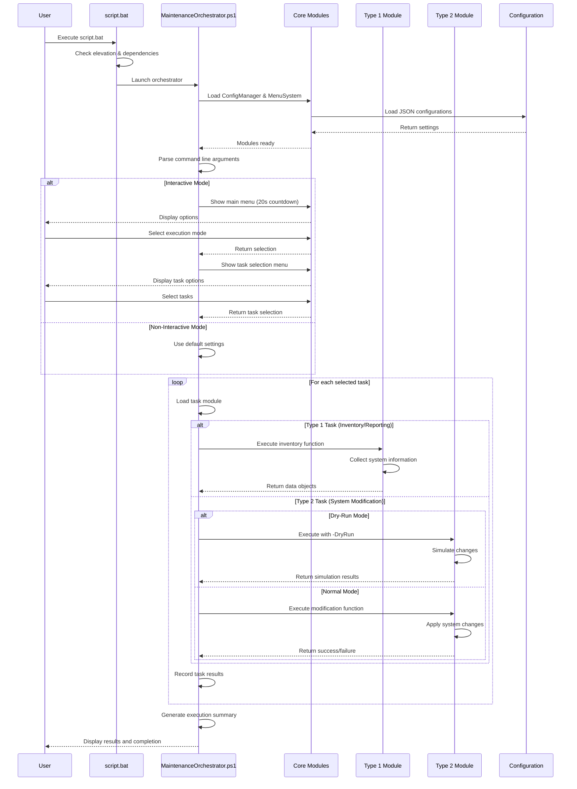
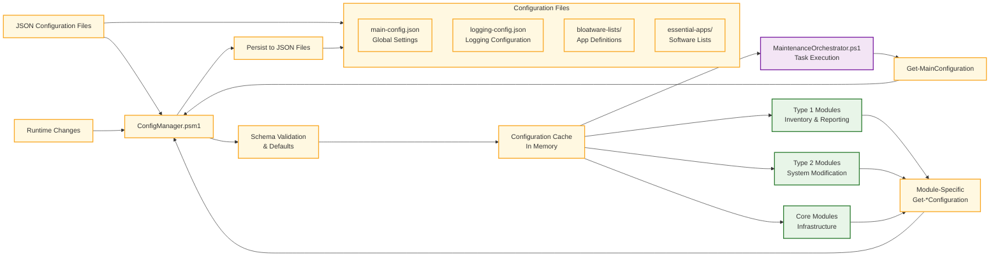

# Windows Maintenance Automation - Architecture Diagram

## System Architecture Overview

```mermaid
graph TB
    %% Entry Points
    User[👤 User] --> Launcher[script.bat<br/>Enhanced Launcher]
    User --> Direct[MaintenanceOrchestrator.ps1<br/>Direct Execution]
    
    %% Launcher Flow
    Launcher --> ElevCheck{Administrator<br/>Check}
    ElevCheck -->|Not Elevated| UAC[Request UAC<br/>Elevation]
    ElevCheck -->|Elevated| DepMgr[Dependency<br/>Bootstrap]
    UAC --> DepMgr
    
    %% Dependency Bootstrap
    DepMgr --> PS7{PowerShell 7<br/>Available?}
    PS7 -->|No| InstallPS7[Install PowerShell 7<br/>via winget/GitHub]
    PS7 -->|Yes| WinGet{winget<br/>Available?}
    InstallPS7 --> WinGet
    WinGet -->|No| InstallWinGet[Install App Installer<br/>Microsoft Store/GitHub]
    WinGet -->|Yes| NuGet{NuGet Provider<br/>Available?}
    InstallWinGet --> NuGet
    NuGet -->|No| InstallNuGet[Install NuGet Provider<br/>PowerShell Gallery]
    NuGet -->|Yes| PSWinUpdate{PSWindowsUpdate<br/>Available?}
    InstallNuGet --> PSWinUpdate
    PSWinUpdate -->|No| InstallPSWU[Install PSWindowsUpdate<br/>PowerShell Gallery]
    PSWinUpdate -->|Yes| Choco{Chocolatey<br/>Available?}
    InstallPSWU --> Choco
    Choco -->|No| InstallChoco[Install Chocolatey<br/>chocolatey.org]
    Choco -->|Yes| LaunchOrch[Launch Orchestrator]
    InstallChoco --> LaunchOrch
    
    %% Direct execution joins here
    Direct --> LaunchOrch
    
    %% Orchestrator Flow
    LaunchOrch --> Orchestrator[MaintenanceOrchestrator.ps1<br/>Central Coordinator]
    Orchestrator --> LoadCore[Load Core Modules]
    LoadCore --> LoadConfig[Initialize Configuration]
    LoadConfig --> ParseArgs[Parse Command Line<br/>Arguments]
    
    %% Menu System
    ParseArgs --> Interactive{Interactive<br/>Mode?}
    Interactive -->|Yes| MainMenu[Show Main Menu<br/>20s Countdown]
    Interactive -->|No| NonInt[Non-Interactive<br/>Execution]
    MainMenu --> ExecMode{Execution<br/>Mode?}
    ExecMode -->|Execute| TaskMenu[Show Task Menu<br/>All/Specific Tasks]
    ExecMode -->|DryRun| TaskMenuDR[Show Task Menu<br/>Dry-Run Mode]
    TaskMenu --> TaskExec[Task Execution]
    TaskMenuDR --> TaskExecDR[Task Execution<br/>Dry-Run Mode]
    NonInt --> TaskExec
    
    %% Core Modules
    subgraph CoreMods[Core Infrastructure Modules]
        ConfigMgr[ConfigManager.psm1<br/>Configuration Management]
        MenuSys[MenuSystem.psm1<br/>Interactive Menus]
        DepMgrMod[DependencyManager.psm1<br/>Package Management]
        TaskSched[TaskScheduler.psm1<br/>Windows Task Scheduling]
    end
    
    LoadCore --> CoreMods
    
    %% Task Execution Engine
    TaskExec --> TaskRegistry[Task Registry<br/>$Tasks Array]
    TaskExecDR --> TaskRegistry
    TaskRegistry --> LoadMod[Load Task Module<br/>On-Demand]
    
    %% Module Types
    LoadMod --> ModType{Module<br/>Type?}
    ModType -->|Type 1| Type1Mods[Type 1: Inventory & Reporting]
    ModType -->|Type 2| Type2Mods[Type 2: System Modification]
    
    %% Type 1 Modules (Inventory & Reporting)
    subgraph Type1[Type 1 Modules - Read-Only Operations]
        SysInv[SystemInventory.psm1<br/>System Information]
        BloatDet[BloatwareDetection.psm1<br/>Bloatware Scanning]
        AppInv[AppInventory.psm1<br/>Application Discovery]
        SecAudit[SecurityAudit.psm1<br/>Security Analysis]
        RepGen[ReportGeneration.psm1<br/>HTML/Text Reports]
    end
    
    Type1Mods --> Type1
    
    %% Type 2 Modules (System Modification)
    subgraph Type2[Type 2 Modules - System Changing Operations]
        BloatRem[BloatwareRemoval.psm1<br/>Application Removal]
        EssApps[EssentialApps.psm1<br/>Application Installation]
        WinUpd[WindowsUpdates.psm1<br/>Update Management]
        TelDis[TelemetryDisable.psm1<br/>Privacy Hardening]
        SysOpt[SystemOptimization.psm1<br/>Performance Tuning]
    end
    
    Type2Mods --> Type2
    
    %% Configuration System
    subgraph ConfigSys[Configuration System - JSON Files]
        MainConf[main-config.json<br/>Global Settings]
        LogConf[logging-config.json<br/>Logging Configuration]
        BloatConf[bloatware-lists/<br/>Categorized Definitions]
        AppConf[essential-apps/<br/>Application Lists]
    end
    
    ConfigMgr --> ConfigSys
    
    %% Output and Reporting
    Type1 --> DataOut[Data Objects<br/>System Information]
    Type2 --> BoolOut[Success/Failure<br/>Boolean Results]
    DataOut --> Reports[Generated Reports<br/>temp_files/reports/]
    BoolOut --> Logging[Operation Logs<br/>temp_files/logs/]
    
    %% Task Results
    Reports --> Results[Task Results<br/>Summary & Details]
    Logging --> Results
    Results --> Complete[Maintenance<br/>Complete]
    
    %% Styling
    classDef launcher fill:#e1f5fe,stroke:#0277bd,stroke-width:2px
    classDef orchestrator fill:#f3e5f5,stroke:#7b1fa2,stroke-width:2px
    classDef core fill:#fff3e0,stroke:#f57c00,stroke-width:2px
    classDef type1 fill:#e8f5e8,stroke:#2e7d32,stroke-width:2px
    classDef type2 fill:#ffebee,stroke:#c62828,stroke-width:2px
    classDef config fill:#fff8e1,stroke:#f9a825,stroke-width:2px
    classDef output fill:#fce4ec,stroke:#ad1457,stroke-width:2px
    
    class Launcher,ElevCheck,UAC,DepMgr launcher
    class Orchestrator,LoadCore,LoadConfig,ParseArgs,Interactive,MainMenu,ExecMode,TaskMenu,TaskMenuDR,TaskExec,TaskExecDR,TaskRegistry,LoadMod,ModType orchestrator
    class CoreMods,ConfigMgr,MenuSys,DepMgrMod,TaskSched core
    class Type1,Type1Mods,SysInv,BloatDet,AppInv,SecAudit,RepGen type1
    class Type2,Type2Mods,BloatRem,EssApps,WinUpd,TelDis,SysOpt type2
    class ConfigSys,MainConf,LogConf,BloatConf,AppConf config
    class DataOut,BoolOut,Reports,Logging,Results,Complete output
```

## Module Interaction Flow

## Configuration Flow

## Key Architectural Principles

1. **Separation of Concerns**: Clear boundaries between inventory (Type 1) and modification (Type 2) operations
2. **Configuration-Driven**: All behavior controlled through JSON files, no hardcoded values
3. **Modular Design**: Independent modules with well-defined interfaces and responsibilities  
4. **Safety First**: Dry-run capabilities and careful parameter validation for all destructive operations
5. **Interactive + Automated**: Support for both attended and unattended execution modes
6. **Self-Discovery**: Location-agnostic execution with automatic environment detection
7. **Dependency Management**: Automated detection and installation of required tools and modules
8. **Comprehensive Logging**: Detailed operation tracking and audit trails for troubleshooting